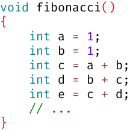
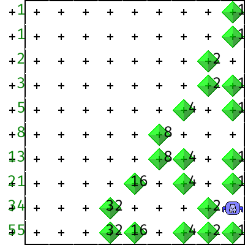

# Woche 3

## Aufgaben

[skorbut.jar](https://raw.githubusercontent.com/fredoverflow/skorbut/release/skorbut.jar) herunterladen und starten

### Aufgabe 3.0 Fibonacci (abnahmepflichtig & klausurrelevant)

Tippe folgende Funktion ab:



Setze den Tastaturcursor irgendwo in die Funktion `fibonacci` und drücke den START-Knopf, um die Funktion zu starten!  
(Den Geschwindigkeitsregler und die STEP-Knöpfe kennst du ja bereits aus Karel.)

1. Diskutiere mit deinem Betreuer folgende Fragen:
   - Was bedeutet `int`?
   - Was bedeutet `int a = 1;`?
   - Was bedeutet `int c = a + b;`?
   - Spielt die Reihenfolge der 5 Zeilen von `int a` bis `int e` eine Rolle?
2. Berechne die 26. Fibonacci-Zahl (endet auf 393):
   - Eine mechanisch heruntergetippte Lösung mit 26 Variablen von `a` bis `z` ist völlig ausreichend
   - Vielleicht fällt dir beim Heruntertippen (oder irgendwann später) eine Lösung mit 2 oder 3 Variablen ein?
     - Eine Variable kann beliebig oft neue Werte annehmen
     - Dann lässt man den Datentyp `int` weg, weil sie ja bereits definiert ist:

```c
int a = ersterWert;
// ...
a = neuerWert;
// ...
a = neuerWert;
// ...
a = neuerWert;
// ...
```

### Aufgabe 3.1 Funktionen (abnahmepflichtig & klausurrelevant)

```c
double hoch2(double x)
{
    return x * x;
}

void hoch2_test()
{
    assert(hoch2( 1  ) ==  1);
    assert(hoch2( 2  ) ==  4);
    assert(hoch2( 3  ) ==  9);
    assert(hoch2(-4  ) == 16);
    assert(hoch2( 0.5) ==  0.25);
}


double hoch3(double x)
{
    // ...
}

void hoch3_test()
{
    // ...
}
```

- Erkläre deinem Betreuer die Funktionen `hoch2` und `hoch2_test`
- Vervollständige die (ähnlichen) Funktionen `hoch3` und `hoch3_test`
- Läuft `hoch3_test` fehlerfrei durch?

```c
int minimum(int x, int y)
{
    if (x < y)
    {
        return x;
    }
    else
    {
        return y;
    }
}

void minimum_test()
{
    assert(minimum(1, 2) == 1);
    assert(minimum(3, 3) == 3);
    assert(minimum(5, 4) == 4);
}


int maximum(int x, int y)
{
    // ...
}

void maximum_test()
{
    // ...
}
```

- Erkläre deinem Betreuer die Funktionen `minimum` und `minimum_test`
- Vervollständige die (ähnlichen) Funktionen `maximum` und `maximum_test`
- Läuft `maximum_test` fehlerfrei durch?


```c
int summeErsterGanzzahlen(int n)
{
    return n * (n + 1) / 2;
}

void summeErsterGanzzahlen_test()
{
    assert(summeErsterGanzzahlen(  1) ==    1);
    assert(summeErsterGanzzahlen(  2) ==    3);
    assert(summeErsterGanzzahlen(  3) ==    6);
    assert(summeErsterGanzzahlen(  4) ==   10);
    assert(summeErsterGanzzahlen(100) == 5050);
}


int summeErsterQuadratzahlen(int n)
{
    // ...
}

void summeErsterQuadratzahlen_test()
{
    // ...
}
```


- Erkläre deinem Betreuer die Funktionen `summeErsterGanzzahlen` und `summeErsterGanzzahlen_test`
- Vervollständige die (ähnlichen) Funktionen `summeErsterQuadratzahlen` und `summeErsterQuadratzahlen_test`
- Läuft `summeErsterQuadratzahlen_test` fehlerfrei durch?

### Aufgabe 3.2 Quadratwurzeln (abnahmepflichtig & klausurrelevant)

```
 _____
|     |            _______
|  x  | √x        | x=a·b | b
|_____|           |_______|
  √x                  a
```

- Die Quadratwurzel von `x` ist die Seitenlänge eines Quadrats mit der Fläche `x`
- Das [Heron-Verfahren](https://de.wikipedia.org/wiki/Heron-Verfahren) berechnet Quadratwurzeln
- Dazu wird das ideale Quadrat durch ein Rechteck angenähert:
  1. Die eine Seitenlänge `a` des Rechtecks wird zunächst beliebig (oder sogar zufällig) geschätzt
  2. Die andere Seitenlänge `b` ergibt sich aus dem geometrischen Zusammenhang `x = a · b`
  3. Der arithmetische Mittelwert aus `a` und `b` ist ein *besserer* Schätzwert für die Seitenlänge `a`
  4. Je nach gewünschter Genauigkeit kann beliebig oft zu Schritt 2 zurückgesprungen werden

Wenn man zum Beispiel die Seitenlänge eines Quadrats mit der Fläche 100 berechnen möchte
und mit dem (beliebig gewählten) Schätzwert 2.0 anfängt,
dann ist der fünfte Mittelwert schon recht nah dran:

| Seitenlänge a | Fläche a · b | Seitenlänge b |   Mittelwert  |
| :-----------: | :----------: | :-----------: | :-----------: |
|    2.000000   |      100     |     50.000000 | **26.000000** |
| **26.000000** |      100     |      3.846154 |   14.923077   |
|   14.923077   |      100     |      6.701031 |   10.812054   |
|   10.812054   |      100     |      9.248936 |   10.030495   |
|   10.030495   |      100     |      9.969598 | **10.000046** |

Im Folgenden wirst du 3 Funktionen implementieren, die aufeinander aufbauen:
1. `mittelwert` benutzt *keine* anderen Funktionen
2. `verbesserung` benutzt `mittelwert` *einmalig*
3. `quadratwurzel` benutzt `verbesserung` *mehrfach*

Implementiere die Funktion `mittelwert` zum Berechnen des arithmetischen Mittelwerts zweier Zahlen:

```c
double mittelwert(double a, double b)
{
    return ___________; // mathematische Formel zum Berechnen des Mittelwerts aus a und b
}

void mittelwert_test()
{
    assert(mittelwert(7.0, 9.0) == 8.0); // zwischen 7.0 und 9.0 liegt 8.0
    assert(mittelwert(6.0, 5.0) == 5.5); // zwischen 6.0 und 5.0 liegt 5.5
}
```

Implementiere die Funktion `verbesserung` zum *einmaligen* Verbessern des Schätzwertes:

```c
double verbesserung(double x, double a)
{
    return mittelwert(_____, _____); // Studiere Tabelle und Einleitungstext aufmerksam!
}

void verbesserung_test()
{
    assert(verbesserung( 8.0, 4.0) == 3.0); // die Wurzel von  8.0 ist nicht 4.0, besser ist 3.0
    assert(verbesserung(10.0, 2.0) == 3.5); // die Wurzel von 10.0 ist nicht 2.0, besser ist 3.5
}
```

Implementiere die Funktion `quadratwurzel` mit 5 Verbesserungen des Schätzwerts:

```c
double quadratwurzel(double x)
{
    double a0 = 2.0;

    double a1 = verbesserung(_____, _____);
    double a2 = verbesserung(_____, _____);
    double a3 = verbesserung(_____, _____);
    double a4 = verbesserung(_____, _____);
    double a5 = verbesserung(_____, _____);

    return __;
}

void quadratwurzel_test()
{
    assert(quadratwurzel(100) == 10.000046356507898);
    assert(quadratwurzel( 64) ==  8.000001273385879);
}
```

### Aufgabe 3.3 Pythagoras (klausurrelevant)

Implementiere die Funktion `hypotenuse` zum Berechnen der Hypotenusenlänge eines rechtwinkligen Dreiecks.
Stelle dazu den Satz des Pythagoras `a² + b² = c²` geeignet um:

```c
double hypotenuse(double a, double b)
{
    // ...
}

void hypotenuse_test()
{
    assert(hypotenuse(3,  4) ==  5.000000000016778);
    assert(hypotenuse(5, 12) == 13.001272448567825);
}
```

### Aufgabe 3.4 Quadratische Gleichungen (klausurrelevant)

Implementiere die Funktion `anzahlLoesungen` zum Bestimmen der Anzahl Lösungen (0 bis 2) einer quadratischen Gleichung:


```c
// Eine quadratische Gleichung der Form  ax² + bx + c = 0  hat 0 bis 2 Lösungen
int anzahlLoesungen(double a, double b, double c)
{
    // Konvertierung in Normalform x² + px + q = 0
    double p = // ...
    double q = // ...
    // ...
}

void anzahlLoesungen_test()
{
    // Überlege dir eigene Beispiel-Gleichungen mit 0, 1, 2 Lösungen!
}
```

## FAQ

### Gibt es Karels Beeper (Bits) auch in C?

- In Karel gibt es Rätsel, die Binärzahlen mit Beepern als Bits realisieren, zum Beispiel `computeFibonacci`:



- Per Konvention interpretiert Karel immer 8 Bits zusammengehörig als eine Zahl (1 Byte)
- Karel kann aber immer nur 1 Bit gleichzeitig manipulieren (mittels `pickBeeper` und `dropBeeper`)
- Operationen zum Addieren von Zahlen (`addSlow` und `addFast` und `addSmart`) müssen mühselig programmiert werden
- In C speichert man Zahlen dagegen in benannten Variablen und kann diese mühelos addieren:


### Was ist eine Variable?

- Eine Variable ist ein Stück Speicher mit einem Datentyp und einem Namen:
  - `int a;`
  - `double x;`
- Der *Datentyp* legt die möglichen Werte fest:
  - `int` für Ganzzahlen
  - `double` für Kommazahlen
- Der Name ermöglicht den (lesenden oder schreibenden) Zugriff auf die Variable:
  - *Schreiben* primär per Zuweisung mit dem Gleichheitszeichen: `a = 42;`
  - *Lesen* in den meisten anderen Kontexten, z.B. Rechnungen: `a + b`
- `int a = 42;` fasst Definition und erste Zuweisung zusammen:
  - `int a;` *Definition*
  - `a = 42;` erste *Zuweisung*
- Jede Funktion kann nur auf ihre eigenen Variablen zugreifen!
- Die Variablen existieren nur, solange die Funktion aktiv ist

### Welche Datentypen gibt es sonst noch?

Skorbut hat feste Grenzen für alle Datentypen, auf anderen Plattformen können diese Grenzen abweichen:

|         Datentyp |   Skorbut Min |   Skorbut Max | Alternative Schreibweisen                  |
| ---------------: | ------------: | ------------: | ------------------------------------------ |
|    `signed char` |          -128 |          +127 | `char`                                     |
|  `unsigned char` |             0 |           255 |                                            |
|   `signed short` |        -32768 |        +32767 | `short` / `short int` / `signed short int` |
| `unsigned short` |             0 |         65535 |                       `unsigned short int` |
|     `signed int` |   -2147483648 |   +2147483647 | `int`   /                `signed`          |
|   `unsigned int` |             0 |    4294967295 |                        `unsigned`          |
|    `signed long` |   -2147483648 |   +2147483647 | `long`  /  `long int` /  `signed long int` |
|  `unsigned long` |             0 |    4294967295 |                        `unsigned long int` |
|          `float` | 1.4 * 10^ -45 | 3.4 * 10^ +38 |                                            |
|         `double` | 4.9 * 10^-324 | 1.8 * 10^+308 |                                            |

Häufig sind `long`s auf 64-bit-Plattform größer und `int`s auf 16-bit-Plattformen kleiner.

### Gibt es Karels `void funktionen()` auch in C?

Ja. Da in Skorbut aber keine Rätsel eingebaut sind, kann man *jede* `void funktion()` starten:

```c
void wohltemperiert()
{
    double gefrierpunkt = 0 * 1.8 + 32;
    double siedepunkt = 100 * 1.8 + 32;
    double koerpernorm = 37 * 1.8 + 32;
    double stille = -273.15 * 1.8 + 32;
}
```

### Wie kommunizieren Karel-Funktionen miteinander?

- Woher weiß `increment` zum Beispiel, *welche* Zahl `addSlow` erhöht haben möchte?
  - Dazu positioniert und dreht `addSlow` Karel vor dem `increment`-Aufruf passend in der Welt
  - nämlich ganz rechts in der zweiten Zeile, und nach Westen schauend
- Und wie bekommt `addSlow` umgekehrt die von `increment` erhöhte Zahl mitgeteilt?
  - Die Frage stellt sich eigentlich gar nicht
  - `increment` und `addSlow` arbeiten in derselben Welt
  - Es brauchen also keine Diamanten “zurückkopiert” werden o.ä.
- Karel-Funktionen kommunizieren also durch Veränderung der Welt (Diamanten sowie Karels Position und Drehung) miteinander

### Wie kommunizieren C-Funktionen miteinander?

```c
double fahrenheit(double celsius)
{
    return celsius * 1.8 + 32;
}

void wohltemperiert()
{
    double gefrierpunkt = fahrenheit(0);
    double siedepunkt = fahrenheit(100);
    double koerpernorm = fahrenheit(37);
    double stille = fahrenheit(-273.15);
}
```

- C-Funktionen kommunizieren über Parameter/Argumente und Ergebnisse miteinander:

```c
Ergebnistyp          Parameter  <----------- 
______            ______________            |
double fahrenheit(double celsius)           |
{                                           |
           __________________               |
    return celsius * 1.8 + 32;              |
}                        |                  |
                     Ergebnis               ^
                         |                  |
void wohltemperiert()    |                  |
{                        v   Aufruf         |
                        _______________     |
    double siedepunkt = fahrenheit(100);    |
                                    |       |
                                     --->---
}                                  Argument
```

- Bei der Definition einer Funktion definiert man:
  - in den runden Klammern beliebig viele *Parameter*
  - vor dem Funktionsnamen einen *Ergebnistyp*
- Bei jedem *Aufruf* einer Funktion übergibt man pro Parameter ein *Argument*
  - Das Argument ist der (Start-)Wert des entsprechenden Parameters
- Die Formel hinter dem `return` wird ausgerechnet
  - und das *Ergebnis* an der Aufruf-Stelle eingesetzt

### Wie prüft man, ob eine Variable einen bestimmten Wert hat?

Der Vergleichsoperator `==` prüft, ob beide Seiten gleich sind:

```C
int absoluteValue(int x)
{
    if (x ==  -2147483648)
    {
        return 2147483647; // weil +2147483648 kein int ist
    }
    else if (x < 0)
    {
        return -x;
    }
    else
    {
        return x;
    }
}
```

### Was bedeutet `assert(annahme);` ?

- Damit wird sichergestellt, dass eine vom Programmierer getroffene Annahme auch tatsächlich wahr ist
- Falls die Annahme wider Erwarten falsch ist, wird das Programm mit einer Fehlermeldung abgebrochen
- Zum Testen von Funktionen ist `assert` sehr praktisch:

```c
void absoluteValue_test()
{
    assert(absoluteValue( 0) == 0);
    assert(absoluteValue(-1) == 1);
    assert(absoluteValue(+2) == 2);

    assert(absoluteValue(-2147483647-1) == 2147483647);
}
```

- Nach Ausführung von `absoluteValue_test` meldet Skorbut links unten:

> [15:45:00] absoluteValue_test: ALL 4 assertions PASSED

### Was ist der Unterschied zwischen `=` und `==` ?

- *Zuweisung*: `x = 42` kopiert den Wert `42` in die Variable `x` rein
- *Vergleich*: `x == 42` prüft, ob die Variable `x` den Wert `42` hat

### Welche Vergleichsoperatoren gibt es sonst noch?

| Operator | Bedeutung      |
| -------- |--------------- |
| `==`     | gleich         |
| `!=`     | ungleich       |
| `<`      | kleiner        |
| `<=`     | kleiner/gleich |
| `>`      | größer         |
| `>=`     | größer/gleich  |

### Wie baut man Karels `repeat (9)` in C nach?

```C
int    countdown = 9;
while (countdown > 0)
{
    // ... eigentlicher Schleifenrumpf ...

     --countdown;
}
```
