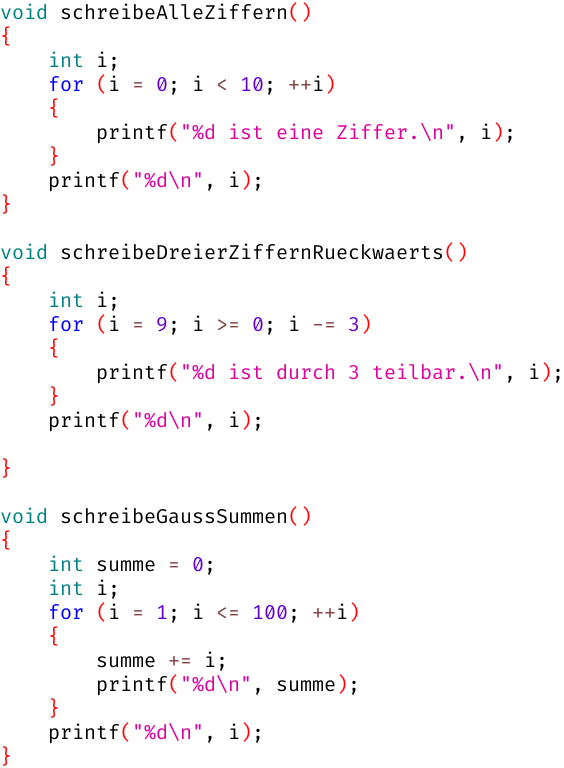

# Woche 4

📺 `for`-Schleife und `printf` in 10 Minuten erklärt: https://www.youtube.com/watch?v=TeoaBJOx36U

## Aufgaben

### Aufgabe 4.0 Zählschleifen (abnahmepflichtig & klausurrelevant)



Diskutiere mit deinem Betreuer für obige 3 Funktionen jeweils folgende 4 Fragen:

1. Welchen Wert hat der Schleifenzähler `i`, wenn der Schleifenrumpf `{}` das erste Mal betreten wird?
2. Welchen Wert hat der Schleifenzähler `i`, wenn der Schleifenrumpf `{}` das letzte Mal betreten wird?
3. Wie oft wird der Schleifenrumpf `{}` betreten?
4. Welchen Wert hat der Schleifenzähler `i`, wenn die Schleife beendet wird?

### Aufgabe 4.1 Quadratzahlen (abnahmepflichtig & klausurrelevant)

Schreibe eine Funktion `void aufgabe_4_1()`, die folgendes auf die Konsole schreibt:

```
 0 *  0 =    0
 1 *  1 =    1
 2 *  2 =    4
 3 *  3 =    9
 4 *  4 =   16
 5 *  5 =   25
 6 *  6 =   36
 7 *  7 =   49
 8 *  8 =   64
 9 *  9 =   81
```
... 80 Zeilen gekürzt ...
```
90 * 90 = 8100
91 * 91 = 8281
92 * 92 = 8464
93 * 93 = 8649
94 * 94 = 8836
95 * 95 = 9025
96 * 96 = 9216
97 * 97 = 9409
98 * 98 = 9604
99 * 99 = 9801
```

Als Platzhalter für `printf` bieten sich zu diesem Zweck `%2d` (zwei Ziffern) und `%4d` (vier Ziffern) an,
dann sind die Zahlen schön gleichmäßig rechtsbündig ausgerichtet.

### Aufgabe 4.2 Geschachtelte Schleifen (abnahmepflichtig & klausurrelevant)

Schreibe eine Funktion `void aufgabe_4_2()`, die zunächst folgendes auf die Konsole schreibt:

```
 7 *  1 =   7
 7 *  2 =  14
 7 *  3 =  21
 7 *  4 =  28
 7 *  5 =  35
 7 *  6 =  42
 7 *  7 =  49
 7 *  8 =  56
 7 *  9 =  63
 7 * 10 =  70
```

Erweitere die Funktion anschließend,
so dass sie nicht nur die Vielfachen von 7 auf die Konsole schreibt,
sondern von allen Zahlen zwischen 1 und 10:

```
 1 *  1 =   1
 1 *  2 =   2
 1 *  3 =   3
 1 *  4 =   4
 1 *  5 =   5
 1 *  6 =   6
 1 *  7 =   7
 1 *  8 =   8
 1 *  9 =   9
 1 * 10 =  10
 2 *  1 =   2
 2 *  2 =   4
 2 *  3 =   6
```
... 84 Zeilen gekürzt ...
```
10 *  8 =  80
10 *  9 =  90
10 * 10 = 100
```

### Aufgabe 4.3 Multiplikationstabelle (klausurrelevant)

Schreibe eine Funktion `void aufgabe_4_3()`, die folgende Multiplikationstabelle auf die Konsole schreibt:

```
  1   2   3   4   5   6   7   8   9  10
  2   4   6   8  10  12  14  16  18  20
  3   6   9  12  15  18  21  24  27  30
  4   8  12  16  20  24  28  32  36  40
  5  10  15  20  25  30  35  40  45  50
  6  12  18  24  30  36  42  48  54  60
  7  14  21  28  35  42  49  56  63  70
  8  16  24  32  40  48  56  64  72  80
  9  18  27  36  45  54  63  72  81  90
 10  20  30  40  50  60  70  80  90 100
```

### Aufgabe 4.4 Quadratzahlen ohne Multiplikation (klausurrelevant)

Schaue dir die Differenzen der aufeinanderfolgenden Quadratzahlen an:

Quadrate    | 0 |   | 1 |   | 4 |   | 9 |   | 16 |   | 25 |    | 36 |    | 49 |
----------- | - | - | - | - | - | - | - | - | -- | - | -- | -- | -- | -- | -- |
Differenzen |   | 1 |   | 3 |   | 5 |   | 7 |    | 9 |    | 11 |    | 13 |    |

Fällt Dir ein Muster auf?
Schreibe eine Funktion `void aufgabe_4_4()`, die Aufgabe 4.1 ohne Multiplikation löst.

## FAQ

### Was bedeutet das `\n` bei `printf`?

Das `\n` steht für einen Zeilenumbruch (**n**ewline).
Dieser kann überall innerhalb der Gänsefüßchen stehen, nicht nur am Ende:

```c
printf("Erste Zeile\nZweite ");
printf("Zeile\nDritte Zeile\n");
```

### Was bedeutet das `%d` bei `printf`?

Die Funktion `printf` ersetzt jeden Platzhalter `%d` durch eine **Ganzzahl** in **d**ezimaler Schreibweise.
Für jeden Platzhalter muss ein weiteres Argument an `printf` übergeben werden:

```c
int a = 89;
int b = 144;   //        __________
int c = a + b; //       /          \ 
printf("%d plus %d ist %d\n", a, b, c); // 89 plus 144 ist 233
//       \                   /
//        \_________________/
```

### Kann man hinter das `%` auch andere Buchstaben schreiben?

Ja, für **Kommazahlen** (`float` oder `double`) gibt es zum Beispiel `%f`:

```c
double z = 22;
double n = 7;
printf("%f durch %f ist %f\n", z, n, z/n); // 22.000000 durch 7.000000 ist 3.142857
```

### Was ist der Unterschied zwischen `float` und `double`?

- `double` braucht *doppelt* so viel Speicher wie `float`, nämlich 8 Bytes statt 4
- `double` hat etwa 16 Dezimalstellen Genauigkeit und `float` nur etwa 7:

```c
double d = 123456789;
float  f = 123456789;
printf("%f\n", d); // 123456789.000000
printf("%f\n", f); // 123456792.000000
//                           ^^
//                           Rundungsfehler
```

In PR1 werden wir immer `double` statt `float` verwenden, da es auf ein paar Bytes nicht ankommt.

### Zählschleifen kennen wir doch schon aus Karel...?

Jein. In Karel können wir immerhin die Anzahl der Wiederholungen festlegen:

```
// Karel
repeat (9)
{
    moveForward(); // wird 9x ausgeführt
}
```

Innerhalb des Schleifenrumpfs wissen wir aber nicht, in welcher der 9 Wiederholungen wir uns gerade befinden.

In C sehen Zählschleifen deutlich komplizierter aus, sind dafür aber auch flexibler/mächtiger:

```c
// C
for (int i = 0; i < 9; ++i)
{
    printf("i ist %d\n", i); // wird 9x ausgeführt
}
```

### Was bedeuten die Bestandteile der `for`-Schleife?

```c
for (Initialisieren; Schleifenbedingung; Zählen)
{
    Schleifenrumpf
}
```

- Beim `Initialisieren` erhält der Schleifenzähler seinen Startwert
  - Das passiert nur einmalig ganz am Anfang
- Die `Schleifenbedingung` entscheidet, ob die Schleife weiter geht oder fertig ist
  - falsch → Die Schleife wird beendet
  - wahr → Der `Schleifenrumpf` wird (erneut) ausgeführt
- Beim `Zählen` wird der Schleifenzähler geeignet verändert
  - Das passiert erst *nach* der Ausführung des Schleifenrumpfs!
  - Anschließend wird die Schleifenbedingung erneut geprüft

### Die `while`-Schleife verstehe ich, die `for`-Schleife aber nicht...?

Theoretisch kann man jede `for`-Schleife in eine `while`-Schleife konvertieren:

```c
Initialisieren;

while (Schleifenbedingung)
{
    Schleifenrumpf

    Zählen;
}
```

Meist ist die entsprechende `for`-Schleife aber besser nachvollziehbar,
weil Initialisieren, Schleifenbedingung und Zählen in derselben Zeile stehen.

### Was ist der beste Ersatz für `repeat (9)`?

Das kommt darauf an, welche konkreten Werte der Schleifenzähler annehmen soll:

```c
//           012345678
for (int i = 0; i <   9; ++i)

//           123456789
for (int i = 1; i <= 9 ; ++i)

//           987654321
for (int i = 9; i >   0; --i)

//           876543210
for (int i = 8; i >= 0 ; --i)
```

Falls einem die konkreten Werte des Schleifenzählers egal sind, ist die erste Variante am beliebtesten.

### Wie zähle ich von `ersterWert` bis `letzterWert` in `schritt`en *hoch*?

```c
for (int i = ersterWert; i <=    letzterWert; i += schritt)

for (int i = ersterWert; i < NACHletzterWert; i += schritt)
```

### Wie zähle ich von `ersterWert` bis `letzterWert` in `schritt`en *runter*?

```c
for (int i = ersterWert; i >=    letzterWert; i -= schritt)

for (int i = ersterWert; i > NACHletzterWert; i -= schritt)
```

### Wie unterscheiden sich `++i` und `i++`?

- Für das Zählen in einer Zählschleife oder als alleinstehende Anweisung gibt es keinen Unterschied zwischen `++i` und `i++`
- Der Unterschied zeigt sich erst, wenn man den Wert von `++i` oder `i++` verwendet:

```c
int i = 0;
int a = ++i;
// i ist 1
// a ist 1

int i = 0;
int a = i++;
// a ist 0
// i ist 1
```

- `++i` hat den neuen Wert von `i`
- `i++` hat den alten Wert von `i`
- Viele Programmierer sind von `i++` so verwirrt, dass ich mittlerweile `++i` bevorzuge

### Erhöht `++i` den Schleifenzähler bereits *vor* der ersten Ausführung des Schleifenrumpfs?

Nein. Das Zählen passiert grundsätzlich *nach* jeder Ausführung des Schleifenrumpfs, egal ob mittels `++i` oder `i++`.

### Verhalten sich `++i` und `i+=1` und `i=i+1` identisch?

Ja.
