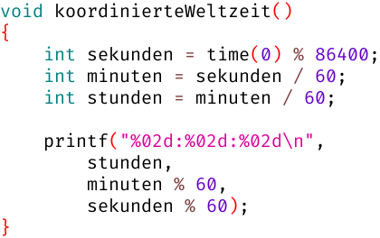

# Woche 5

## Aufgaben

### Aufgabe 5.0 Koordinierte Weltzeit (abnahmepflichtig & klausurrelevant)



Diskutiere mit deinem Betreuer folgende Fragen:
1. Welchen Wert liefert `time(0)`?
2. Welche Bedeutung hat die Zahl `86400`? Notfalls Google fragen 😉
3. Welche effektiven Wertebereiche haben die Variablen `sekunden`, `minuten`, `stunden` jeweils?
4. Warum werden die letzten beiden Argumente an `printf` mit `% 60` verrechnet?
5. Welchen Unterschied macht es, ob man `%02d` oder `%2d` oder `%d` verwendet? **Probiere es aus!**

### Aufgabe 5.1 Zahlenraten (abnahmepflichtig & klausurrelevant)

Schreibe eine Funktion `void zahlenraten()`.
Der Computer denkt sich mittels `time(0) % 101` eine zufällige Zahl aus, und der Mensch muss diese Zahl erraten:

```
Ich habe mir eine Zahl zwischen 0 und 100 ausgedacht.
Welche Zahl mag es wohl sein?

10
Leider daneben getippt! Ich hatte mir die 11 ausgedacht.
Vielleicht haben Sie ja im nächsten Spiel mehr Glück!
```
(`10` ist eine Tastatur-Eingabe des Benutzers.)

- Um das Spiel interessanter zu gestalten, soll der Mensch beliebig oft raten dürfen
- Der Computer antwortet jedes Mal wahrheitsgemäß, ob seine Zahl größer oder kleiner ist
- Sobald der Mensch die richtige Zahl eintippt, wird das Spiel beendet:

```
Ich habe mir eine Zahl zwischen 0 und 100 ausgedacht.
Welche Zahl mag es wohl sein?

10
Meine Zahl ist größer!

20
Meine Zahl ist kleiner!

12
Meine Zahl ist kleiner!

11
Herzlichen Glückwunsch, das ist meine Zahl!
```
(`10` und `20` und `12` und `11` sind Tastatur-Eingaben des Benutzers.)

Protokolliere zuletzt die Anzahl Rateversuche:

```
11
Herzlichen Glückwunsch, das ist meine Zahl!
Sie haben 4 Rateversuche gebraucht.
```

### Aufgabe 5.2 Taschenrechner (abnahmepflichtig & klausurrelevant)

Schreibe eine Funktion `void taschenrechner()`, die einfache Rechnungen
(2 Zahlen mit 1 Operator dazwischen) von der Tastatur einliest und ausrechnet:

```
Ich beherrsche die 4 Grundrechenarten!
Was wollen Sie ausrechnen?

1.5+2.5
4.000000

10-1
9.000000

6*7
42.000000

22/7
3.142857

2^8
Den Operator ^ kenne ich nicht!
```
(`1.5+2.5` und `10-1` und `6*7` und `22/7` und `2^8` sind Tastatur-Eingaben des Benutzers.)

- Verwende ein `switch` für die Unterscheidung der Operatoren
- Kann dein Code mit Leerzeichen vor Operatoren umgehen, zum Beispiel `1 + 2` statt `1+2`?
- Extrahiere die eigentliche Berechnung in eine separate Funktion `ausrechnen`:

```c
double ausrechnen(double links, char operator, double rechts)
{
    // ...
}

void ausrechnen_test()
{
    assert(ausrechnen(1.5, '+', 2.5) ==  4);
    assert(ausrechnen(10 , '-', 1  ) ==  9);
    assert(ausrechnen( 6 , '*', 7  ) == 42);
    assert(ausrechnen(22 , '/', 7  ) ==  3.142857142857143);
}
```

### Aufgabe 5.3 Rollentausch (klausurrelevant)

Schreibe eine Funktion `void rollentausch()`.
Diesmal denkt der Mensch sich eine Zahl aus, und der Computer errät sie:

```
Soso, Sie haben sich also eine Zahl zwischen 0 und 100 ausgedacht...

Ist es die 50? +

Ist es die 75? -

Ist es die 62? -

Ist es die 56? +

Ist es die 59? =

Geschafft, und das mit gerade mal 5 Rateversuchen!
```
(`+` und `-` und `=` sind Tastatur-Eingaben des Benutzers.)

Denkanstöße:

- Wie kommt ein guter Spieler (egal ob Mensch oder Computer) überhaupt dazu, obige Zahlen nacheinander raten?
- Ein guter Spieler weiß, in welchem Zahlenbereich die Zufallszahl liegen muss, und verfeinert dieses Wissen schrittweise:

|   Die Zufallszahl liegt | sinnvoller Rateversuch | Gegenspieler sagt |
| ----------------------: | :--------------------: | ----------------- |
| zwischen      0 und 100 |           50           | +                 |
| zwischen **51** und 100 |           75           | -                 |
| zwischen 51 und  **74** |           62           | -                 |
| zwischen 51 und  **61** |           56           | +                 |
| zwischen **57** und  61 |           59           | =                 |

- Wie viele Variablen braucht der Computer für Spalte 1 obiger Tabelle?
  - Was sind sinnvolle Startwerte für diese Variablen?
  - Wann ändern sich diese Variablen, und wie?
- Die zu ratende Zufallszahl selber benötigt *keine* Variable. Warum?

### Aufgabe 5.4 Welcher Tag ist heute? (klausurrelevant)

Schreibe eine Funktion `void welcherTagIstHeute()`,
die den heutigen Tag auf die Konsole schreibt:

```
Heute ist der 13. November 2023
```

Denkanstöße:

- `time(0)` liefert die Anzahl vergangener Sekunden seit Mitternacht des 1. Januar 1970
- Wie viele Tage sind das?
- Die 48 Monate von Januar 1970 bis Dezember 1973 wiederholen sich bis zum Gemeinjahr 2100 periodisch:

Jahr | Jan | Feb | Mär | Apr | Mai | Jun | Jul | Aug | Sep | Okt | Nov | Dez |
---- | :-: | :-: | :-: | :-: | :-: | :-: | :-: | :-: | :-: | :-: | :-: | :-: |
1970 |  31 |  28 |  31 |  30 |  31 |  30 |  31 |  31 |  30 |  31 |  30 |  31 |
1971 |  31 |  28 |  31 |  30 |  31 |  30 |  31 |  31 |  30 |  31 |  30 |  31 |
1972 |  31 |**29**| 31 |  30 |  31 |  30 |  31 |  31 |  30 |  31 |  30 |  31 |
1973 |  31 |  28 |  31 |  30 |  31 |  30 |  31 |  31 |  30 |  31 |  30 |  31 |

## FAQ

### Welchen Wert liefert `time(0)`?

- Die Anzahl vergangener Sekunden seit Mitternacht des 1. Januar 1970 laut [koordinierter Weltzeit](https://de.wikipedia.org/wiki/Koordinierte_Weltzeit)
- Diese hinkt Deutschland im Winter 1 Stunde hinterher und im Sommer sogar 2 Stunden

### Was bedeutet `dividend % divisor` ?

Das ist der Divisionsrest, der beim Teilen übrig bleibt:

```c
void division_test()
{
    assert(22 / 7 == 3);
    assert(22 % 7 == 1); // Divisionsrest

    assert(22 == 7 * 3 + 1);
}
```

```
___7___
aaaaaaa |
bbbbbbb 3
ccccccc |
d
1
```

### Wie liest man eine Ganzahl von der Konsole ein?

Dazu definiert man zunächst eine Variable, in welcher die Zahl später einmal landen soll:

```c
int lieblingszahl;
```

Dann sollte man einen sinnvollen Text auf die Konsole schreiben,
der dem Benutzer klar macht, dass er jetzt etwas eingeben soll,
aber rein technisch ist das natürlich nicht erforderlich:

```c
printf("Was ist Ihre Lieblingszahl? ");
```

Und zuletzt ruft man die Funktion `scanf` auf:

```c
scanf("%d", &lieblingszahl);
//          ^
```

### Was bedeutet das `&` vor `lieblingszahl`?

- Ohne das `&` würden wir versuchen, den aktuellen Wert von `lieblingszahl` an `scanf` zu übergeben, aber in `lieblingszahl` steht ja noch gar kein Wert drin
- Außerdem wollen wir auch gar nicht den aktuellen *Wert* übergeben, sondern "die Variable selber", damit `scanf` den eingelesenen Wert in `lieblingszahl` abspeichern kann

### Wie liest man Kommazahlen von der Konsole ein?

```c
float x;
scanf ("%f", &x); //  %f für float
printf("%f",  x);

double y;
scanf("%lf", &y); // %lf für double
printf("%f",  y);
```

Für `double` verwenden `printf` und `scanf` verschiedene Prozent-Platzhalter:

Funktion | `float` | `double` |
-------: | ------: | -------: |
`printf` |    `%f` |     `%f` |
`scanf`  |    `%f` |    `%lf` |

### Wie liest man einzelne Zeichen von der Konsole ein?

```c
// Akzeptiert ALLE Zeichen, inkl. Leerzeichen und Eingabezeichen:

char x;
scanf("%c", &x);


// Ignoriert Leerzeichen und Eingabezeichen:

char y;
scanf(" %c", &y);
//     ^_________ Man beachte das Leerzeichen vor dem Prozentzeichen!

assert(y != ' ');
assert(y != '\n');
```

- Das Leerzeichen macht nur vor `%c` zum Einlesen einzelner *Zeichen* einen Unterschied
- Beim Einlesen von *Zahlen* werden Leerzeichen und Eingabezeichen grundsätzlich ignoriert
- Das Eingabezeichen `\n` entsteht, wenn der Benutzer die bisherige Eingabe mit der [Eingabetaste](https://de.wikipedia.org/wiki/Eingabetaste) bestätigt
- Bis dahin blockiert `scanf` die Programmausführung

### Wie funktioniert `switch (x)` ?

Die Programmausführung springt abhängig von `x` zur passenden `case`-Marke:

```c
int romanValue(char romanLetter)
{
    switch (romanLetter)
    {
        case 'I': return    1;
        case 'V': return    5;
        case 'X': return   10;
        case 'L': return   50;
        case 'C': return  100;
        case 'D': return  500;
        case 'M': return 1000;

        default: return -1;
    }
}

void romanValue_test()
{
    assert(romanValue('I') ==    1);
    assert(romanValue('V') ==    5);
    assert(romanValue('X') ==   10);
    assert(romanValue('L') ==   50);
    assert(romanValue('C') ==  100);
    assert(romanValue('D') ==  500);
    assert(romanValue('M') == 1000);

    assert(romanValue('A') == -1);
}
```

- Dabei springt `return` wie gewohnt aus der aktuellen Funktion `romanValue` raus
- Um stattdessen unterhalb des `switch`-Rumpfs weiterzumachen, benutzt man `break`:

```c
int romanValue(char romanLetter)
{
    int result;

    switch (romanLetter)
    {
        case 'I': result =    1; break;
        case 'V': result =    5; break;
        case 'X': result =   10; break;
        case 'L': result =   50; break;
        case 'C': result =  100; break;
        case 'D': result =  500; break;
        case 'M': result = 1000; break;
                                 //
        default: result = -1;   //
    }                          //
    // Hier geht es nach dem BREAK; weiter

    return result;
}
```

- Ohne `break` würde die Programmausführung innerhalb des `switch`-Rumpfs einfach weitergehen
- Dieses Phänomen bezeichnet man als "case fallthrough", weil man quasi durch alle folgenden `case`-Marken durchfällt
- Meist passiert "case fallthrough" versehentlich, weil man das `break` vergessen hat
- Manchmal kann es aber durchaus praktisch sein, wenn mehrere Fälle gleich behandelt werden sollen:

```c
double averageMonthLength(int month)
{
    switch (month)
    {
        case  2: return 28.2425;

        case  4:    // case
        case  6:   // fall
        case  9:  // through
        case 11: return 30;

        case  1:       // case
        case  3:      // fall
        case  5:     // through
        case  7:    // case
        case  8:   // fall
        case 10:  // through
        case 12: return 31;

        default: return -1;
    }
}

void averageMonthLength_test()
{
    assert(averageMonthLength( 0) == -1);

    assert(averageMonthLength( 1) == 31);
    assert(averageMonthLength( 2) == 28.2425);
    assert(averageMonthLength( 3) == 31);
    assert(averageMonthLength( 4) == 30);
    assert(averageMonthLength( 5) == 31);
    assert(averageMonthLength( 6) == 30);
    assert(averageMonthLength( 7) == 31);
    assert(averageMonthLength( 8) == 31);
    assert(averageMonthLength( 9) == 30);
    assert(averageMonthLength(10) == 31);
    assert(averageMonthLength(11) == 30);
    assert(averageMonthLength(12) == 31);

    assert(averageMonthLength(13) == -1);
}
```
