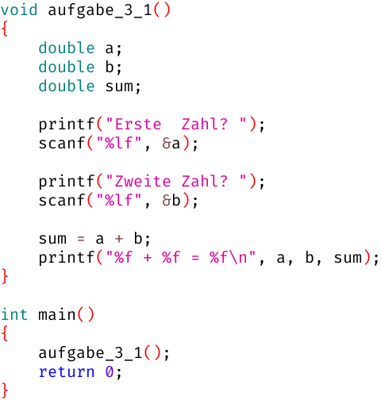

# Woche 3

## Aufgaben

### Aufgabe 3.0 (Pflicht)

Installiere Skorbut ab Schritt 6 gemäß https://github.com/fredoverflow/skorbut-release#getting-started

(Java wurde ja bereits für Karel The Robot installiert, deshalb kannst du die ersten 5 Schritte überspringen.)

### Aufgabe 3.1 Summen (Pflicht)

Tippe folgendes Programm ab:



Diskutiere mit deinem Betreuer folgende Fragen:

- Was bedeutet `double a;`?
- Was bedeutet `scanf("%lf", &a);`?
- Kann man `sum = a + b;` auch weiter oben hinschreiben?
- Was bedeutet `printf("%f + %f = %f\n", a, b, sum);`?
- Wie viele Variablen werden innerhalb von `aufgabe_3_1` definiert?
- Wie viele Funktionsaufrufe befinden sich innerhalb von `aufgabe_3_1`?
- Wie viele Argumente werden beim letzten `printf`-Aufruf übergeben?

### Aufgabe 3.2 Quadratwurzeln (Pflicht)

Mit dem [Heron-Verfahren](https://de.wikipedia.org/wiki/Heron-Verfahren) berechnet man Quadratwurzeln.
Dieses startet mit einem beliebigen Schätzwert und verfeinert diesen Schätzwert
durch wiederholte Mittelwertbildung aus dem Schätzwert und dem Quotient aus Radikand und Schätzwert.

Hier ein Beispiel zum Berechnen der Quadratwurzel von `100.0`:

- Wir fangen mit `1.0` als beliebigem Schätzwert an
- `mittelwert( 1.0 , 100/ 1.0 ) = 50.5`
- `mittelwert(50.5 , 100/50.5 ) = 26.24`
- `mittelwert(26.24, 100/26.24) = 15.03`
- `mittelwert(15.03, 100/15.03) = 10.84`
- `mittelwert(10.84, 100/10.84) = 10.03`
- Nach 5 Rechnungen ist uns der erreichte Schätzwert `10.03` gut genug

Wende das Verfahren handschriftlich für mindestens zwei weitere Zahlen an.

Schreibe eine Funktion `aufgabe_3_2`, die sich wie folgt verhalten soll:
```
Herzlich willkommen zum Berechnen von Quadratwurzeln!

Radikand? 100

  Wurzel: 10.032579
```
(Die `100` ist eine Eingabe des Benutzers.)

### Aufgabe 3.3 Rechtwinklige Dreiecke (Pflicht)

Schreibe eine Funktion `aufgabe_3_3`, die sich wie folgt verhalten soll:
```
Herzlich willkommen zum Berechnen rechtwinkliger Dreiecke!

   Ankathete? 3.0
Gegenkathete? 4.0

  Hypotenuse: 5.000023
```
(`3.0` und `4.0` sind Eingaben des Benutzers.)

Die Länge der Hypotenuse kannst du mit dem Satz des Pythagoras bestimmen.

Das Heron-Verfahren hast du jetzt wahrscheinlich zweimal implementiert;
das erste Mal in `aufgabe_3_2` und das zweite Mal in `aufgabe_3_3`.
Eliminiere diese Code-Duplizierung durch eine eigene Funktion `double root(double x)`.
Diese Funktion soll die Quadratwurzel von `x` mittels Heron-Verfahren berechnen und an den Aufrufer zurückliefern.
Nun können `aufgabe_3_2` und `aufgabe_3_3` diese Funktion `root` aufrufen, anstatt die Quadratwurzel selber zu berechnen.

### Aufgabe 3.4 Quadratische Gleichungen (Kür)

Schreibe eine Funktion `aufgabe_3_4`, die sich wie folgt verhalten soll:
```
Herzlich willkommen zum Lösen quadratischer Gleichungen!

+------------------+
| ax² + bx + c = 0 |
+------------------+

 a? 4.0
 b? 5.0
 c? -6.0

x1: -2.000000
x2: 0.750000
```
(`4.0` und `5.0` und `-6.0` sind Eingaben des Benutzers.)

**Achtung:** Nicht jede Gleichung der Form ax²+bx+c = 0 hat genau 2 Lösungen!
Welche Sonderfälle kannst du identifizieren?
Das Programm sollte sinnvoll darauf reagieren!

Wenn du den kompletten Code in `aufgabe_3_4` packst, wird die Funktion sehr unübersichtlich.
Es empfiehlt sich, die Sonderfälle in eigene Funktionen auszulagern.

## FAQ

### Was passiert in Skorbut, wenn man auf den START-Button drückt?

Skorbut sucht nach einer speziellen Funktion namens `main` und führt diese aus:

```C
int main()
{
    printf("hello world!\n");
    return 0;
}
```

### Welchen Sinn hat das `\n` bei `printf`?

Damit generiert man einen Zeilenumbruch. Dieser kann überall innerhalb der Gänsefüßchen stehen, nicht nur am Ende:

```C
printf("one\ntwo\nthree\n\nI've come to collect the fee!\n");
```

### Warum steht da `int` statt `void`, und was bedeutet `return 0;`?

Damit signalisiert die `main`-Funktion dem System, dass sie fehlerfrei durchgelaufen ist.
Im Rahmen von PR1 ist das aber nicht weiter relevant.
Wenn man versucht, einen anderen Datentyp als `int` zu verwenden oder das `return` vergisst,
gibt es entsprechende Warnungen oder Fehlermeldungen.

### Was ist eine Variable?

- Eine Variable ist ein Stück Speicher mit einem Namen und einem Datentyp
- Um eine Variable zu definieren, schreibt man erst den Datentyp, dann den Namen und zuletzt ein Semikolon: `int a;`
- Der Datentyp legt die Wertemenge fest, z.B. `int` für Ganzzahlen
- Der Name ermöglicht den (lesenden oder schreibenden) Zugriff auf die Variable
  - Schreiben per Zuweisung mit dem Gleichheitszeichen: `a = 42;`
  - Lesen in allen anderen Kontexten, z.B. Rechnungen: `a + b`
- Jede Funktion kann nur auf ihre eigenen Variablen zugreifen

### Welche Datentypen gibt es sonst noch?

Skorbut hat feste Grenzen für alle Datentypen, auf anderen Plattformen können diese Grenzen abweichen:

|         Datentyp |   Skorbut Min |   Skorbut Max | Alternative Schreibweisen                  |
| ---------------: | ------------: | ------------: | ------------------------------------------ |
|    `signed char` |          -128 |          +127 | `char`                                     |
|  `unsigned char` |             0 |           255 |                                            |
|   `signed short` |        -32768 |        +32767 | `short` / `short int` / `signed short int` |
| `unsigned short` |             0 |         65535 |                       `unsigned short int` |
|     `signed int` |   -2147483648 |   +2147483647 | `int`   /                `signed`          |
|   `unsigned int` |             0 |    4294967295 |                        `unsigned`          |
|    `signed long` |   -2147483648 |   +2147483647 | `long`  /  `long int` /  `signed long int` |
|  `unsigned long` |             0 |    4294967295 |                        `unsigned long int` |
|          `float` | 1.4 * 10^ -45 | 3.4 * 10^ +38 |                                            |
|         `double` | 4.9 * 10^-324 | 1.8 * 10^+308 |                                            |

Häufig sind `long`s auf 64-bit-Plattform größer und `int`s auf 16-bit-Plattformen kleiner.

### Wie schreibt man eine Funktion, die eine Ganzzahl entgegennimmt?

Dazu muss man in den runden Klammern hinter dem Funktionsnamen einen Parameter vom Datentyp `int` definieren:

```C
                   // ----- Parameter von print_neighbours
void print_neighbours(int x)
{
    printf("%d liegt zwischen %d und %d\n", x, x-1, x+1);
}       // -------------------------------  -  ---  --- Argumente an printf

int main()
{
    print_neighbours(42);
    print_neighbours(97);
    print_neighbours( 0);
    return 0;     // -- Argument an print_neighbours
}
```
    
Ein Parameter ist eine spezielle Variable, die beim Aufruf der Funktion mit einem konkreten Wert befüllt wird.
Diesen konkreten Wert nennt man auch Argument.
In diesem Beispiel ist also `int x` der Parameter,
und `42` ist das entsprechende Argument beim ersten Aufruf der Funktion.

### Welchen Sinn hat das `%d` bei `printf`?

Damit sagt man der Funktion `printf`, dass sie an der Stelle, wo das `%d` auftaucht,
eine ganze Zahl auf die Konsole schreiben soll, und zwar im Dezimalsystem.
Die entsprechende Zahl muss man als weiteres Argument übergeben.

Wie man beim Aufruf von `printf` sehr schön sieht, können Argumente nicht nur konstante Zahlen wie `42` sein,
sondern auch Variablen wie `x` oder Rechnungen wie `x-1` und `x+1`.

### Kann man hinter das `%` auch etwas anderes schreiben als `d`?

Ja, für Kommazahlen (`float` oder `double`) gibt es zum Beispiel `%f`.

### Was ist der Unterschied zwischen `float` und `double`?

`float` hat etwa 7 Stellen Genauigkeit und `double` etwa 16.
Dafür verbraucht `double` aber auch doppelt so viel Speicher wie `float`.
Im Rahmen von PR1 werden wir immer `double` verwenden, da es auf ein paar Bytes nicht ankommt :)

### Wie liest man eine Ganzahl von der Konsole ein?

Dazu definiert man zunächst eine Variable, in welcher die Zahl später einmal landen soll:

```C
int a;
```

Dann sollte man einen sinnvollen Text auf die Konsole schreiben,
der dem Benutzer klar macht, dass er jetzt etwas eingeben soll,
aber rein technisch ist das natürlich nicht erforderlich:

```C
printf("Was ist ihre Lieblingszahl? ");
```

Und zuletzt ruft man die Funktion `scanf` auf:

```C
scanf("%d", &a);
```

### Was bedeutet das `&` vor `a`?

Wenn das `&` dort nicht stehen würde, dann würden wir versuchen,
den aktuellen Wert von `a` an `scanf` zu übergeben,
aber in `a` steht ja noch gar kein sinnvoller Wert drin.
Stattdessen wollen wir `scanf` "die Variable an sich" übergeben,
damit `scanf` den eingelesenen Wert in der Variable `a` ablegen kann.
(Technisch wird die Speicheradresse der Variable `a` an `scanf` übergeben,
aber diesen Sachverhalt schauen wir uns erst später im Detail an.)

### Wie liest man Kommazahlen von der Konsole ein?

Im Gegensatz zu `printf`, wo `%f` sowohl für `float` als auch für `double` steht,
unterscheidet `scanf` zwischen `float` (`%f`) und `double` (`%lf`).
Dafür gibt es technische Gründe, die aber im Rahmen von PR1 nicht relevant sind.

### Wie schreibt man eine Funktion, die eine Ganzzahl liefert?

Genau so, wie `main` das auch macht, also mit `int` statt `void` und einem `return`:

```C
int average(int a, int b)
{
    return (a + b) / 2;
}
```

Im Gegensatz zu `void`-Funktionen sollte man `average` aber nicht "einfach so" aufrufen:

```C
average(10, 20);
```

Skorbut generiert eine entsprechende Warnung, weil es keinen Sinn macht,
den Durchschnitt von 10 und 20 zu berechnen und das Ergebnis (in diesem Fall 15) anschließend zu verwerfen.
Wir sollten irgendwas mit dem Ergebnis tun,
zum Beispiel in einer Variable speichern oder als Argument an eine Funktion übergeben,
ansonsten hätte der Computer den Durchschnitt ja ganz umsonst berechnet:

```C
int a = average(10, 20);
printf("Die Antwort lautet %d\n", a);

printf("Die Antwort lautet %d\n", average(40, 44));
```

### Wie prüft man, ob eine Variable einen bestimmten Wert hat?

```C
void pruefe_antwort(int x)
{
    if (x == 42)
    {
        printf("Korrekt!\n");
    }
    else
    {
        printf("Daneben!\n");
    }
}
```

### Was ist der Unterschied zwischen `=` und `==`?

Diese beiden Operatoren werden so häufig von Anfängern verwechselt,
dass Skorbut entsprechende Warnungen generiert.
`x == 42` prüft, ob in der Variable `x` die Zahl `42` gespeichert ist.
`x = 42` weist dagegen den Wert `42` an die Variable `x` zu,
d.h. `x` hat anschließend den Wert `42`, egal welcher Wert vorher in `x` gespeichert war.

### Welche Vergleichsoperatoren gibt es sonst noch in C?

    a < b    kleiner
    a > b    größer
    a <= b   kleiner oder gleich
    a >= b   größer oder gleich
    a != b   ungleich

### Wie kann man mehrere Bedingungen miteinander kombinieren?

Genau wie in Karel, mit `&&` (und) bzw. `||` (oder):

```C
if (0 <= x && x < 10)
{
    printf("x besteht lediglich aus einer Ziffer!\n");
}
else
{
    printf("x ist negativ und/oder besteht aus mehreren Ziffern!\n");
}

if (x == 2 || x == 3 || x == 5 || x == 7)
{
    printf("x ist eine einstellige Primzahl!\n");
}
```

## Literatur

Anfängern empfehle ich das Buch "Grundkurs C" von Jürgen Wolf und René Krooß.
Das Buch behandelt den aktuellen Sprachstandard C18.
Skorbut unterstützt allerdings nur ANSI C89 bzw. ISO C90, und das auch nicht vollständig.
Für das Selbststudium zu Woche 3 empfehle ich folgende Kapitel:

- Kapitel 4: Rechnen mit C und Operatoren
  - Seite 95: Skorbut kennt nur `+=` und `-=`
  - Seite 97: Skorbut wertet grundsätzlich von links nach rechts aus, und Nebeneffekte treten unverzögert auf
  - Kapitel 4.5: Bitoperatoren behandeln wir erst später
  - Kapitel 4.8: Mathematische Funktionen werden keine mitgeliefert, die müssen wir bei Bedarf selber bauen
- Kapitel 5: Bedingte Anweisung und Verzweigung
  - Kapitel 5.5: Mehrfache Verzweigung mit `switch` behandeln wir erst später
- Kapitel 7: Funktionen erstellen
  - Kapitel 7.7: `inline`-Funktionen sind C99
  - Kapitel 7.8: Rekursion behandeln wir erst später
  - Kapitel 7.10: Skorbut kennt kein `exit`
