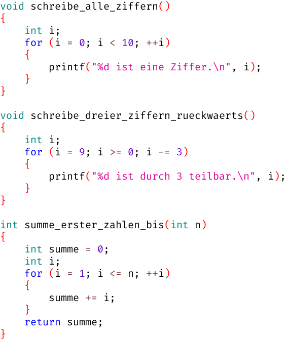

# Woche 4

## Aufgaben

### Aufgabe 4.1 Zählschleifen (Pflicht)

Diskutiere mit deinem Betreuer die untenstehenden Zählschleifen anhand folgender Fragen:
- Welchen Wert hat der Schleifenzähler, wenn der Schleifenrumpf das erste Mal betreten wird?
- Welchen Wert hat der Schleifenzähler, wenn der Schleifenrumpf das letzte Mal betreten wird?
- Welchen Wert hat der Schleifenzähler, wenn die Schleifenbedingung falsch ist?
- Wie oft wird der Schleifenrumpf betreten?



### Aufgabe 4.2 Quadratzahlen (Pflicht)

Schreibe eine Funktion `void aufgabe_4_2()`, die den Benutzer nach einer Obergrenze fragt
und anschließend sämtliche Quadratzahlen bis zu dieser Obergrenze auf die Konsole schreibt:
```
Obergrenze? 8

1 * 1 = 1
2 * 2 = 4
3 * 3 = 9
4 * 4 = 16
5 * 5 = 25
6 * 6 = 36
7 * 7 = 49
8 * 8 = 64
```
(Die `8` ist eine Eingabe des Benutzers.)

### Aufgabe 4.3 Multiplikationstabelle (Pflicht)

Schreibe eine Funktion `void aufgabe_4_3()`, die folgende Multiplikationstabelle mit 2 Zählschleifen auf die Konsole schreibt:
```
  1   2   3   4   5   6   7   8   9  10
  2   4   6   8  10  12  14  16  18  20
  3   6   9  12  15  18  21  24  27  30
  4   8  12  16  20  24  28  32  36  40
  5  10  15  20  25  30  35  40  45  50
  6  12  18  24  30  36  42  48  54  60
  7  14  21  28  35  42  49  56  63  70
  8  16  24  32  40  48  56  64  72  80
  9  18  27  36  45  54  63  72  81  90
 10  20  30  40  50  60  70  80  90 100
```
Als Platzhalter für `printf` bietet sich zu diesem Zweck `%3d` an, d.h. 3 Dezimalziffern.
Dann sind die Zahlen schön gleichmäßig rechtsbündig ausgerichtet.

Ergänze die Multiplikationstabelle um eine Zeilenüberschrift und eine Spaltenüberschrift für die Faktoren:
```
    |   1   2   3   4   5   6   7   8   9  10
----+----------------------------------------
  1 |   1   2   3   4   5   6   7   8   9  10
  2 |   2   4   6   8  10  12  14  16  18  20
  3 |   3   6   9  12  15  18  21  24  27  30
  4 |   4   8  12  16  20  24  28  32  36  40
  5 |   5  10  15  20  25  30  35  40  45  50
  6 |   6  12  18  24  30  36  42  48  54  60
  7 |   7  14  21  28  35  42  49  56  63  70
  8 |   8  16  24  32  40  48  56  64  72  80
  9 |   9  18  27  36  45  54  63  72  81  90
 10 |  10  20  30  40  50  60  70  80  90 100
```
Entscheide selber, ob du für die Zeilenüberschrift eine Zählschleife verwenden möchtest oder nicht.

### Aufgabe 4.4 Quadratzahlen ohne Multiplikation (Kür)

Schaue dir die Differenzen der aufeinanderfolgenden Quadratzahlen an:

Quadrate    | 1 |   | 4 |   | 9 |   | 16 |   | 25 |    | 36 |
----------- | - | - | - | - | - | - | -- | - | -- | -- | -- |
Differenzen |   | 3 |   | 5 |   | 7 |    | 9 |    | 11 |    |

Fällt Dir ein Muster auf?
Schreibe eine Funktion `void aufgabe_4_4()`, die Aufgabe 4.2 ohne Multiplikation löst.

## FAQ

### Zählschleifen kennen wir doch schon aus Karel...?

Jein. In Karel können wir immerhin die Anzahl der Wiederholungen festlegen:
```
// Karel
repeat (9)
{
    moveForward(); // wird 9x ausgeführt
}
```

Wir wissen aber innerhalb des Schleifenrumpfs nicht, in welcher der 9 Wiederholungen wir uns gerade befinden.

In C sehen Zählschleifen deutlich komplizierter aus, sind dafür aber auch flexibler/mächtiger:
```c
// C
for (int i = 0; i < 9; ++i)
{
    printf("i ist %d\n", i); // wird 9x ausgeführt
}
```

### Was bedeuten die Bestandteile der `for`-Schleife?

```c
for (Initialisieren; Schleifenbedingung; Zählen)
{
    Schleifenrumpf
}
```

- Beim `Initialisieren` erhält der Schleifenzähler seinen Startwert
  - Das passiert nur einmalig ganz am Anfang
- Die `Schleifenbedingung` entscheidet, ob die Zählschleife weiter geht oder fertig ist
  - wahr: Der Schleifenrumpf wird (erneut) ausgeführt
  - falsch: Die Zählschleife wird abgebrochen
- Beim `Zählen` wird der Schleifenzähler geeignet verändert
  - Das passiert erst *nach* der Ausführung des Schleifenrumpfs!
  - Anschließend wird die Schleifenbedingung erneut geprüft

### Die `while`-Schleife verstehe ich, die `for`-Schleife aber nicht...?

Man kann jede `for`-Schleife in eine `while`-Schleife umschreiben:

```c
Initialisieren;

while (Schleifenbedingung)
{
    Schleifenrumpf

    Zählen;
}
```

Eigentlicht braucht man die `for`-Schleife also gar nicht, sie macht Programme aber häufig lesbarer.

## Was ist der beste Ersatz für `repeat (9)`?

Das kommt darauf an, welche konkreten Werte der Schleifenzähler annehmen soll:
- 012345678: `for (int i = 0; i < 9; ++i)`
- 123456789: `for (int i = 1; i <= 9; ++i)`
- 987654321: `for (int i = 9; i > 0; --i)`
- 876543210: `for (int i = 8; i >= 0; --i)`

Falls einem die konkreten Werte des Schleifenzählers egal sind, ist die erste Variante am beliebtesten.

## Wie unterscheiden sich `++i` und `i++`?

- Für das Zählen in einer Zählschleife oder als alleinstehende Anweisung gibt es keinen Unterschied zwischen `++i` und `i++`
- Der Unterschied zeigt sich erst, wenn man den Wert von `++i` oder `i++` verwendet:

```c
int i = 0;
int a = ++i;
// i ist 1
// a ist 1

int i = 0;
int a = i++;
// a ist 0
// i ist 1
```

- `++i` hat den neuen Wert von `i`
- `i++` hat den alten Wert von `i`
  - Wann genau die Erhöhung stattfindet, ist in C nicht messerscharf definiert
- Viele Programmierer sind von `i++` so verwirrt, dass ich mittlerweile `++i` bevorzuge
  - Spätestens das Überladen der `++` Operatoren in `C++` beweist, dass `++i` objektiv einfacher ist als `i++`

## Erhöht `++i` den Schleifenzähler bereits *vor* der ersten Ausführung des Schleifenrumpfs?

Nein. Das Zählen passiert grunsätzlich *nach* jeder Ausführung des Schleifenrumpfs, egal ob mittels `++i` oder `i++`.

## Literatur

Anfängern empfehle ich das Buch "Grundkurs C" von Jürgen Wolf und René Krooß.
Das Buch behandelt den aktuellen Sprachstandard C18.
Skorbut unterstützt allerdings nur ANSI C89 bzw. ISO C90, und das auch nicht vollständig.
Für das Selbststudium zu Woche 4 empfehle ich folgende Kapitel:

- Kapitel 6: Schleifen – Programmteile wiederholen
  - Kapitel 6.1: Die Zählschleife – for
