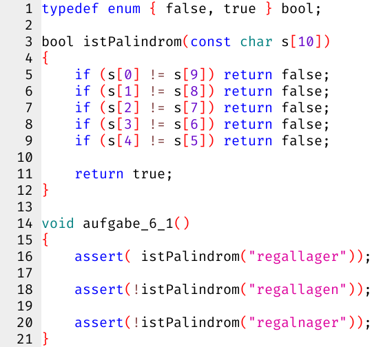

# Woche 6

## Aufgaben

### Aufgabe 6.1 Palindrom-Prüfer (Pflicht)

Die Funktion `istPalindrom` hat 6 `return`-Anweisungen.
In der Funktion `aufgabe_6_1` befinden sich 3 Aufrufe der Funktion `istPalindrom`.
- Der Aufruf in Zeile 16 endet mit welcher `return`-Anweisung?
- Der Aufruf in Zeile 18 endet mit welcher `return`-Anweisung?
- Der Aufruf in Zeile 20 endet mit welcher `return`-Anweisung?



Aufgrund der 5 Fallunterscheidungen mit Zugriffen auf die Positionen von 0 bis 9 funktioniert `istPalindrom` so nur mit Zeichenketten der Länge 10.
Der Parameter `(const char s[10])` dokumentiert diese Einschränkung für den Aufrufer,
aber tatsächlich ignoriert C diese Größenangabe **bei Funktions-Parametern**,
weil der Parameter `s` keine Kopie der Zeichenkette ist, sondern nur ein Verweis auf das Original,
und der (konstante) Speicherverbrauch eines solchen Verweises ist unabhängig von der Größe des Arrays.
(In Skorbut werden solche Verweise in der Speichersicht links als orangene Pfeile dargestellt.)
Dies ist eine **Sonderregel für Funktions-Parameter**; an anderen Stellen ist die Größe relevant!

Behebe diese Einschränkung, d.h. `bool istPalindrom(const char s[])` soll mit beliebig langen Zeichenketten zurechtkommen.
Die Länge einer Zeichenkette `s` findet man mit `strlen(s)` heraus.
Wie hängt die Anzahl notwendiger Fallunterscheidungen (vorher 5) von dieser Länge ab?

### Aufgabe 6.2 Palindrom-Generator (Pflicht)

Schreibe eine Funktion `void aufgabe_6_2()`, die sich wie folgt verhalten soll:

```
Herzlich willkommen beim Palindrom-Generator!

Wort? regal
regallager

Wort? lager
lagerregal

Wort? regallager
regallager
```
(Die 3 Wörter hinter den Fragezeichen sind Eingaben des Benutzers.)

D.h. Palindrome werden unverändert auf die Konsole geschrieben,
während Nicht-Palindrome erst normal und dann gespiegelt auf die Konsole geschrieben werden.

Die Spiegelung soll *nicht* im Arbeitsspeicher geschehen; das kommt erst in Aufgabe 6.4 dran.
Schreibe stattdessen eine separate Funktion `void schreibeGespiegelt(const char s[])`,
die einfach jedes Zeichen einzeln auf die Konsole schreibt, und zwar von rechts nach links.

### Aufgabe 6.3 Zensur (Kür)

Schreibe eine Funktion `void zensiere(char s[])`, die Ziffern mit Kreuzen zensiert:

```c
void aufgabe_6_3()
{
    char a[] = "Meine PIN ist 1234, und meine Telefonnummer ist 0123 / 456 78 90";
    zensiere(a);
    assert(strcmp(a, "Meine PIN ist XXXX, und meine Telefonnummer ist XXXX / XXX XX XX") == 0);
}
```

### Aufgabe 6.4 Spiegeln (Kür)

Schreibe eine Funktion `void spiegele(char s[])`, die das übergebene Wort spiegelt:

```c
void aufgabe_6_4()
{
    char a[] = "regal";
    spiegele(a);
    assert(strcmp(a, "lager") == 0);
}
```

## FAQ

### Welchen Sinn hat `typedef enum { false, true } bool;`?

ANSI C89 bzw. ISO C90 hat keinen Datentyp für Wahrheitswerte.
Vergleiche liefern stattdessen einen `int`, nämlich `0` (falsch) oder `1` (wahr):

```c
//       0  1
printf("%d %d\n", 42 == 97, 42 != 97);
```

Für die Lesbarkeit von Programmen sind Zahlen als Wahrheitswerte eher unschön:

```c
int istPrim(int zahl)
{
    if (zahl < 2) return 0; // hier bedeutet 0 falsch
    if (zahl == 2) return 1; // hier bedeutet 1 wahr
    if (zahl % 2 == 0) return 0; // hier bedeutet 0 falsch
    
    for (int teiler = 3; teiler * teiler <= zahl; teiler += 2)
    {
        if (zahl % teiler == 0) return 0; // hier bedeutet 0 falsch
    }
    return 1; // hier bedeutet 1 wahr
}
```

Wenn C89/C90 einen Datentyp für Wahrheitswerte hätte, könnte man stattdessen schreiben:

```c
bool istPrim(int zahl)
{
    if (zahl < 2) return false;
    if (zahl == 2) return true;
    if (zahl % 2 == 0) return false;
    
    for (int teiler = 3; teiler * teiler <= zahl; teiler += 2)
    {
        if (zahl % teiler == 0) return false;
    }
    return true;
}
```

Im Prinzip brauchen wir also nur folgende Abbildungen:

1. `bool` bedeutet `int`
2. `false` bedeutet `0`
3. `true` bedeutet `1`

Und genau das leistet `typedef enum { false, true } bool;` im Wesentlichen.

Die Bezeichnung `bool` (C99, C++, C#) bzw. `boolean` (Java, JavaScript) geht auf den englischen Mathematiker, Logiker und Philosophen *George Boole* (1815 - 1864) zurück.


### Was bedeutet `assert(annahme);`?

Damit stellt C sicher, dass eine von uns getroffene Annahme auch tatsächlich wahr ist.
Falls die Annahme falsch ist, wird das Programm mit einer Fehlermeldung abgebrochen.
Im Wesentlichen verhält sich `assert` wie folgende Funktion:
```c
void assert(bool annahme)
{
    if (annahme == false)
    {
        printf("assertion failed\n");
        exit(1); // Beendet das Programm (kennt Skorbut nicht)
    }
}
```

Für **Anwender** bietet `assert` wenig Mehrwert.
Tatsächlich wird `assert` in Produktiv-Umgebungen aus Performance-Gründen häufig deaktiviert.

Für **Entwickler** ist `assert` zum Testen eigener Funktion attraktiv.
Zum Beispiel stellt `test_istPrim` sicher, dass `istPrim` zumindest für die ersten 20 Zahlen korrekt funktioniert:

```c
void test_istPrim()
{
    assert(!istPrim( 0));
    assert(!istPrim( 1));
    assert( istPrim( 2));
    assert( istPrim( 3));
    assert(!istPrim( 4));
    assert( istPrim( 5));
    assert(!istPrim( 6));
    assert( istPrim( 7));
    assert(!istPrim( 8));
    assert(!istPrim( 9));
    assert(!istPrim(10));
    assert( istPrim(11));
    assert(!istPrim(12));
    assert( istPrim(13));
    assert(!istPrim(14));
    assert(!istPrim(15));
    assert(!istPrim(16));
    assert( istPrim(17));
    assert(!istPrim(18));
    assert( istPrim(19));
}
```

Als **Lehrender** verwende ich `assert` gerne zur kompakten Grundlagen-Vermittlung. Anstatt:

> Genau wie in der Mathematik bindet Multiplikation in C stärker als Addition.

schreibe ich einfach:

```c
assert(2 * 3 + 5 * 7 == (2 * 3) + (5 * 7));
```

Falls ihr mir nicht glaubt, dass C tatsächlich so funktioniert, führt ihr den Code einfach aus!

### Was ist eine Zeichenkette (engl. String)?

Eine Zeichenkette ist eine Sequenz von Zeichen, die hintereinander im Speicher liegen.
Das Ende einer Zeichenkette wird mit dem speziellen Zeichen `'\0'` (NUL-Terminator, ASCII-Code `0`) markiert:

      Positionen: 0 1 2 3 4 5
    Zeichenkette: H a l l o \0

Der NUL-Terminator `\0` ist in String-Literalen wie `"Hallo"` bereits implizit enthalten.

- Die *Größe* von `"Hallo"` ist 6 (inkl. NUL-Terminator)
- Die *Länge* von `"Hallo"` ist 5 (exkl. NUL-Terminator)

```c
void grundlagen()
{
    assert(sizeof "Hallo"  == 6);
    assert(strlen("Hallo") == 5);
    
    assert("Hallo"[0] == 'H');
    assert("Hallo"[1] == 'a');
    assert("Hallo"[2] == 'l');
    assert("Hallo"[3] == 'l');
    assert("Hallo"[4] == 'o');
    assert("Hallo"[5] == '\0');
    
    assert('\0' == 0); // unsichtbarer NUL-Terminator
    assert('0' == 48); // sichtbare Ziffer 0
}
```

### Wie benutze ich Zeichenketten in `scanf` und `printf`?

```c
void gruesseNutzer()
{
    printf("Name? ");
    char name[16];
    scanf ( "%15s", name);
    
    printf("Hallo %s\n", name);
}
```

Dabei steht die `15` in `%15s` für die maximale Länge (exkl. NUL-Terminator).

### Wie übergebe ich eine Zeichenkette an eine *lesende* Funktion?

Mit dem Parametertyp `const char[]`:

```c
bool istFrage(const char s[])
{
    if (s[0] == '\0') return false; // "" hat kein letztes Zeichen
    
    int laenge = strlen(s);
    int letztePosition = laenge - 1;
    char letztesZeichen = s[letztePosition];
    return letztesZeichen == '?';
}

void test_istFrage()
{
    assert( istFrage("Wie geht's?"));
    assert(!istFrage("Passt schon."));
}
```

Dabei stellt das `const` in `const char s[]` sicher, dass die Funktion auf `s` nur lesend zugreift.
Zeichenketten werden beim Aufruf von Funktionen nämlich *nicht* kopiert,
sondern die aufgerufene Funktion hat Zugriff auf das Original des Aufrufers!

### Wie übergebe ich eine Zeichenkette an eine (potenziell) *schreibende* Funktion?

Mit dem Parametertyp `char[]`, ohne `const`:

```c
void betone(char s[])
{
    if (s[0] == '\0') return; // "" hat kein letztes Zeichen
    
    int laenge = strlen(s);
    int letztePosition = laenge - 1;
    char letztesZeichen = s[letztePosition];
    if (letztesZeichen == '.')
    {
        s[letztePosition] = '!'; // würde mit const char s[] nicht funktionieren
    }
}

void test_betone()
{
    char satz[] = "Auf geht's.";
    assert(satz[10] == '.');
    
    betone(satz);
    assert(satz[10] == '!');
}
```

### Wie vergleiche ich Zeichenketten?

```c
void zugang()
{
    char passwort[16];
    scanf("%15s", passwort);
    
    if (strcmp(passwort, "geheim") == 0)
    {
        printf("Willkommen im Club!\n");
    }
}
```

Dabei liefert `strcmp(a, b)`:
- 0, falls `a` gleich `b` ist
- *irgendeine* negative Zahl, falls `a` lexikographisch vor `b` liegt
- *irgendeine* positive Zahl, falls `a` lexikographisch nach `b` liegt

Mit den bekannten Vergleichsoperatoren `a == b` bzw. `a != b` vergleicht man dagegen nur die Speicheradressen von `a` und `b`, was in der Praxis selten sinnvoll ist.

## Literatur

Anfängern empfehle ich das Buch "Grundkurs C" von Jürgen Wolf und René Krooß.
Das Buch behandelt den aktuellen Sprachstandard C18.
Skorbut unterstützt allerdings nur ANSI C89 bzw. ISO C90, und das auch nicht vollständig.
Für das Selbststudium zu Woche 6 kann man folgende Kapitel lesen, oben steht aber eigentlich schon alles relevante:

- Kapitel 9.3: Strings (Zeichenketten)
  - Seite 241: Statt `EXIT_FAILURE` muss man `1` verwenden
  - Seite 242: Statt `fgets` müsste man selber eine Funktion `void readLine(char a[], unsigned size)` schreiben, basierend auf `char x = getchar();` oder `scanf("%c", &y);` (siehe Aufgabe 5.3)
  - Seite 243: Statt `#define MAX 20` muss man `enum { MAX = 20 };` schreiben
  - Kapitel 9.3.3: Unicode gibt es in C89/C90 noch nicht
  - Kapitel 9.3.4: Aus `string.h` kennt Skorbut nur `unsigned strlen(const char s[])` und `int strcmp(const char s[], const char t[])`, die anderen müsste man selber bauen
  - Kapitel 9.3.6: `sprintf` kennt Skorbut nicht, die Umwandlung zwischen Zahlen und Strings werden wir uns später im Detail anschauen bzw. selber nachbauen
