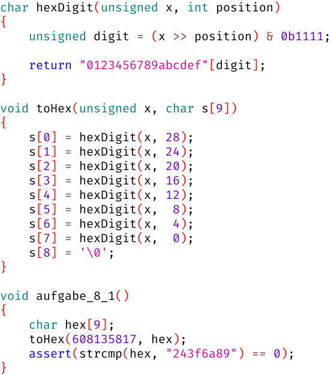

# Woche 8

## Aufgaben

### Aufgabe 8.1 Hexadezimal und Oktal (Pflicht)

Die zweite Funktion `toHex` konvertiert eine 32-Bit-Zahl in einen Hexadezimal-String:

```
0010 0100 0011 1111 0110 1010 1000 1001    Bits
   2    4    3    f    6    a    8    9    Hex
```

Dazu ruft sie die erste Funktion `hexDigit` für jede Ziffer auf.
Die hexadezimale `'6'` wird z.B. wie folgt ermittelt:

```
  28   24   20   16   12    8    4    0    Position
   |    |    |    |    |    |    |    |
0010 0100 0011 1111 0110 1010 1000 1001     x
   2    4    3    f    6    a    8    9
0000 0000 0000 0010 0100 0011 1111 0110     x >> 12
                  2    4    3    f    6
0000 0000 0000 0000 0000 0000 0000 0110    (x >> 12) & 0xb1111
                                      6

                              0011 0110    "0123456789abcdef"[6]
                                 '6'
```



Implementiere die Funktion `toOctal` für die Umwandlung in einen Oktal-String (Basis 8):

```c
void toOctal(unsigned x, char s[12])
{
    // ...
}

void aufgabe_8_1()
{
    char oct[12];
    toOctal(1542498485, oct);
    assert(strcmp(oct, "13374124265") == 0);
}
```

### Aufgabe 8.2 Endian (Pflicht)

Implementiere die Funktion `endianswap`,
welche die beiden Byte-Paare am Rand und in der Mitte jeweils miteinander vertauscht.
Hierzu bietet es sich an, immer 8 Bits auf einmal zu isolieren,
an die passende Stelle zu schieben und am Ende die Zwischenergebnisse zu verschmelzen:

```
x = 1a2b3c4d

a = 1a000000 (Isolieren) &
b = 002b0000
c = 00003c00
d = 0000004d

A = 0000001a (Verschieben) >> bzw. <<
B = 00002b00
C = 003c0000
D = 4d000000

y = 4d3c2b1a (Verschmelzen) + oder |
```

```c
unsigned endianswap(unsigned x)
{
    // ...
}

void aufgabe_8_2()
{
    assert(endianswap(0x1a2b3c4d) == 0x4d3c2b1a);
}
```

### Aufgabe 8.3 YouTube (Kür)

Jedes YouTube-Video hat eine 11-stellige Video-Id, die sich in der URL befindet:
```
                                ___________
https://www.youtube.com/watch?v=jMxoGqsmk5Y
```

Diese Video-Id ist in einem Zahlensystem mit 64 verschiedenen Ziffern kodiert:
```
A 000000    I 001000    Q 010000    Y 011000    g 100000    o 101000    w 110000    4 111000    
B 000001    J 001001    R 010001    Z 011001    h 100001    p 101001    x 110001    5 111001    
C 000010    K 001010    S 010010    a 011010    i 100010    q 101010    y 110010    6 111010    
D 000011    L 001011    T 010011    b 011011    j 100011    r 101011    z 110011    7 111011    
E 000100    M 001100    U 010100    c 011100    k 100100    s 101100    0 110100    8 111100    
F 000101    N 001101    V 010101    d 011101    l 100101    t 101101    1 110101    9 111101    
G 000110    O 001110    W 010110    e 011110    m 100110    u 101110    2 110110    - 111110    
H 000111    P 001111    X 010111    f 011111    n 100111    v 101111    3 110111    _ 111111    
```

Auf unser Beispiel angewendet:
```
j      M      x      o      G      q      s      m      k      5      Y
100011 001100 110001 101000 000110 101010 101100 100110 100100 111001 011000
```

- Jede Ziffer entspricht 6 Bits
- 11 Ziffern entsprechen 66 Bits
- Davon nutzt YouTube aber nur 64 Bits
  - Die ersten 10 Ziffern nutzen das komplette Alphabet
  - Die letzte Ziffer nutzt das kleinere Alphabet `AEIMQUYcgkosw048`
    - Kannst du das anhand einer handvoll realer YouTube-URLs bestätigen?
    - Was haben die 16 Ziffern `AEIMQUYcgkosw048` in binär gemeinsam?
  - Wie viele Videos kann YouTube maximal unterscheiden?

Leider hat Skorbut keinen 64-Bit-Ganzzahltyp, deshalb beschränken wir uns auf 6 Ziffern statt 11.
Implementiere die Funktion `parseVideoId`:

```c
unsigned parseVideoId(const char id[6])
{
    // ...
}

void aufgabe_8_3()
{
    assert(parseVideoId("EzfA3g") == 322420958);
}
```

### Aufgabe 8.4 Binär (Kür)

Implementiere die Funktion `toBinary` für die Umwandlung in einen Binär-String (Basis 2) **ohne führende Nullen**:

```c
void toBinary(unsigned x, char s[33])
{
    // ...
}

void aufgabe_8_4()
{
    char bin[33];
    
    toBinary(3235826430, bin);
    assert(strcmp(bin, "11000000110111101100101011111110") == 0);
    //                     c   0   d   e   c   a   f   e
    
    toBinary(3141592653, bin);
    assert(strcmp(bin, "10111011010000001110011001001101") == 0);
    //                   2  7  3  2  0  1  6  3  1  1  5
    
    toBinary(12345, bin);
    assert(strcmp(bin, "11000000111001") == 0);
    
    toBinary(42, bin);
    assert(strcmp(bin, "101010") == 0);
    
    toBinary(1, bin);
    assert(strcmp(bin, "1") == 0);
    
    toBinary(0, bin);
    assert(strcmp(bin, "0") == 0);
}
```

## FAQ

### Wandelt die Funktion `toHex` (Aufgabe 8.1) von *dezimal* nach hexadezimal um?

Nein. Intern repräsentiert C alle Zahlentypen in *binär*,
weil Computer sehr effizient binär rechnen können.
Das erklärt auch die "krummen" dezimalen Grenzen der Datentypen:

|         Datentyp | Binäre Grenzen | Dezimale Grenzen | Alternative Schreibweisen                  |
| ---------------: | -------------: | ---------------: | ------------------------------------------ |
|    `signed char` | -10000000<br>+01111111 | -128<br>+127 | `char`                                     |
|  `unsigned char` |  00000000<br> 11111111 |    0<br> 255 |                                            |
|   `signed short` | -1000000000000000<br>+0111111111111111 | -32768<br>+32767 | `short` / `short int` / `signed short int` |
| `unsigned short` |  0000000000000000<br> 1111111111111111 |      0<br> 65535 |                       `unsigned short int` |
|     `signed int` | -10000000000000000000000000000000<br>+01111111111111111111111111111111 | -2147483648<br>+2147483647 | `int`   /                `signed`          |
|   `unsigned int` |  00000000000000000000000000000000<br> 11111111111111111111111111111111 |           0<br> 4294967295 |                        `unsigned`          |

Menschen schreiben eine binäre Ziffer (*bi*nary dig*it* = *bit*) gerne als 0 oder 1,
aber Computer kennen nicht mal Nullen und Einsen.
Realistischer wäre wohl eher "Strom aus / Strom an" oder "wenig Spannung / viel Spannung".

Nun will man die Interaktion mit Menschen aber nicht durch Stromschläge realisieren,
also muss der Computer bei Konsolen-Anwendungen ständig
zwischen interner Repräsentation und menschenlesbaren Zeichenfolgen umwandeln,
denn die Konsole ist ja eigentlich nichts weiter als eine ständig wachsende Zeichenkette.
Diese Umwandlung muss für *jedes* Zahlensystem passieren, auch für binär!

Dezimal ist nochmal schwieriger als binär, weil Zehn keine Zweierpotenz ist.
Die interaktive Umwandlung *nach* Dezimal übernimmt `printf("%d", x);`
und die Umwandlung *von* Dezimal `scanf("%d", &x);`

### Aber `toHex(608135817, hex);` sieht so dezimal aus?!

Ein Programm ist erstmal nur eine Textdatei auf der Festplatte.
(Skorbut zeigt den Pfad dieser Textdatei links oben im Fenstertitel an,
z.B. `C:\Users\fred\skorbut\skorbut.txt`)
Und Programmierer sind auch nur Menschen; mit Vorliebe für das Dezimalsystem!
Daher werden *Literale* wie `10` in einem Programm normalerweise dezimal interpretiert.
Mit zusätzlichen Zeichen kann man aber andere Interpretationen bewirken:

| Interpretation | Beispiel | Interne Repräsentation |
| -------------- | -------: | ---------------------- |
| Dezimal        |     `10` | ☆☆☆☆☆☆☆☆ ☆☆☆☆☆☆☆☆ ☆☆☆☆☆☆☆☆ ☆☆☆☆★☆★☆ |
| Hexadezimal    |   `0x10` | ☆☆☆☆☆☆☆☆ ☆☆☆☆☆☆☆☆ ☆☆☆☆☆☆☆☆ ☆☆☆★☆☆☆☆ |
| Oktal          |    `010` | ☆☆☆☆☆☆☆☆ ☆☆☆☆☆☆☆☆ ☆☆☆☆☆☆☆☆ ☆☆☆☆★☆☆☆ |
| Binär †        |   `0b10` | ☆☆☆☆☆☆☆☆ ☆☆☆☆☆☆☆☆ ☆☆☆☆☆☆☆☆ ☆☆☆☆☆☆★☆ |
| String         |   `"10"` | ☆☆★★☆☆☆★ ☆☆★★☆☆☆☆ ☆☆☆☆☆☆☆☆ |

† zu Lehrzwecken in Skorbut eingebaut; *nicht* Standard-konform!

### Was ist denn das für eine Platzverschwendung, überall ☆☆☆☆☆☆☆☆?

Jeder `int` verbraucht gleich viel Speicher, egal wie groß der Wert ist:

```c
void fixedSize()
{
    assert(4 == sizeof(int)); // kann auf anderen Systemen auch 2 oder 8 sein

    assert(4 == sizeof 1);
    assert(4 == sizeof 12);
    assert(4 == sizeof 123);
    assert(4 == sizeof 1234);
    assert(4 == sizeof 12345);
    assert(4 == sizeof 123456);
    assert(4 == sizeof 1234567);
    assert(4 == sizeof 12345678);
    assert(4 == sizeof 123456789);
    assert(4 == sizeof 1234567890);
}
```

Dafür werden alle Rechen-Operationen sehr effizient in Hardware ausgeführt.
Es gibt auch Bibliotheken für "beliebig wachsende" Zahlen (*bignum*),
aber dann sind Rechen-Operationen häufig um Größenordnungen langsamer.

### Die interne Repräsentation von `"10"` verwirrt mich gerade?!

Das ist ein NUL-terminierter ASCII-String bestehend aus den Bytes 49, 48 und 0:

```c
void asciiString()
{
    assert(sizeof "10"  == 3);

    assert(strlen("10") == 2);

    assert("10"[0] == '1');
    assert(           '1' == 49);

    assert("10"[1] == '0');
    assert(           '0' == 48);

    assert("10"[2] == '\0');
    assert(           '\0' == 0);
}
```

### Wieso ist `'0' == 48`?

Das ist im ASCII-Code so festgelegt:

```
   32    0  48    @  64    P  80    `  96    p 112
!  33    1  49    A  65    Q  81    a  97    q 113
"  34    2  50    B  66    R  82    b  98    r 114
#  35    3  51    C  67    S  83    c  99    s 115
$  36    4  52    D  68    T  84    d 100    t 116
%  37    5  53    E  69    U  85    e 101    u 117
&  38    6  54    F  70    V  86    f 102    v 118
'  39    7  55    G  71    W  87    g 103    w 119
(  40    8  56    H  72    X  88    h 104    x 120
)  41    9  57    I  73    Y  89    i 105    y 121
*  42    :  58    J  74    Z  90    j 106    z 122
+  43    ;  59    K  75    [  91    k 107    { 123
,  44    <  60    L  76    \  92    l 108    | 124
-  45    =  61    M  77    ]  93    m 109    } 125
.  46    >  62    N  78    ^  94    n 110    ~ 126
/  47    ?  63    O  79    _  95    o 111
```

### Wo hast du diese Tabelle her?

Die kann man sich ganz einfach selber generieren:

```c
void asciiTable()
{
    for (int left = 32; left < 48; ++left)
    {
        for (int i = left; i < 127; i += 16)
        {
            printf("%c %3d    ", i, i);
        }
        putchar('\n');
    }
}
```

### Wie funktionieren die Bit-Operatoren?

#### `x & y`

```
★ ☆ ★ ★ ★ ☆ ★ ★  ☆ ★ ☆ ☆ ☆ ☆ ☆ ☆  ★ ★ ★ ☆ ☆ ★ ★ ☆  ☆ ★ ☆ ☆ ★ ★ ☆ ★    x
★ ★ ☆ ☆ ☆ ☆ ☆ ☆  ★ ★ ☆ ★ ★ ★ ★ ☆  ★ ★ ☆ ☆ ★ ☆ ★ ☆  ★ ★ ★ ★ ★ ★ ★ ☆    y

★ ☆ ☆ ☆ ☆ ☆ ☆ ☆  ☆ ★ ☆ ☆ ☆ ☆ ☆ ☆  ★ ★ ☆ ☆ ☆ ☆ ★ ☆  ☆ ★ ☆ ☆ ★ ★ ☆ ☆    x & y
```

- Jedes Ziel-Bit ist nur dann ★, wenn beide Quell-Bits ★ sind

#### Wie isoliere ich ein Byte?

```
★ ☆ ★ ★ ★ ☆ ★ ★  ☆ ★ ☆ ☆ ☆ ☆ ☆ ☆  ★ ★ ★ ☆ ☆ ★ ★ ☆  ☆ ★ ☆ ☆ ★ ★ ☆ ★    x
☆ ☆ ☆ ☆ ☆ ☆ ☆ ☆  ☆ ☆ ☆ ☆ ☆ ☆ ☆ ☆  ★ ★ ★ ★ ★ ★ ★ ★  ☆ ☆ ☆ ☆ ☆ ☆ ☆ ☆    y

☆ ☆ ☆ ☆ ☆ ☆ ☆ ☆  ☆ ☆ ☆ ☆ ☆ ☆ ☆ ☆  ★ ★ ★ ☆ ☆ ★ ★ ☆  ☆ ☆ ☆ ☆ ☆ ☆ ☆ ☆    x & y
```

- `y` bezeichnet man in diesem Kontext als *Bitmaske*

#### `x | y`

```
★ ☆ ★ ★ ★ ☆ ★ ★  ☆ ★ ☆ ☆ ☆ ☆ ☆ ☆  ★ ★ ★ ☆ ☆ ★ ★ ☆  ☆ ★ ☆ ☆ ★ ★ ☆ ★    x
★ ★ ☆ ☆ ☆ ☆ ☆ ☆  ★ ★ ☆ ★ ★ ★ ★ ☆  ★ ★ ☆ ☆ ★ ☆ ★ ☆  ★ ★ ★ ★ ★ ★ ★ ☆    y

★ ★ ★ ★ ★ ☆ ★ ★  ★ ★ ☆ ★ ★ ★ ★ ☆  ★ ★ ★ ☆ ★ ★ ★ ☆  ★ ★ ★ ★ ★ ★ ★ ★    x | y
```

- Jedes Ziel-Bit ist nur dann ☆, wenn beide Quell-Bits ☆ sind

#### Wie verschmelze ich isolierte Bytes?

```
☆ ☆ ☆ ☆ ☆ ☆ ☆ ☆  ☆ ☆ ☆ ☆ ☆ ☆ ☆ ☆  ☆ ☆ ☆ ☆ ☆ ☆ ☆ ☆  ☆ ★ ☆ ☆ ★ ★ ☆ ★    x
☆ ☆ ☆ ☆ ☆ ☆ ☆ ☆  ☆ ☆ ☆ ☆ ☆ ☆ ☆ ☆  ★ ★ ★ ☆ ☆ ★ ★ ☆  ☆ ☆ ☆ ☆ ☆ ☆ ☆ ☆    y

☆ ☆ ☆ ☆ ☆ ☆ ☆ ☆  ☆ ☆ ☆ ☆ ☆ ☆ ☆ ☆  ★ ★ ★ ☆ ☆ ★ ★ ☆  ☆ ★ ☆ ☆ ★ ★ ☆ ★    x | y
```

- Hier würde auch `x + y` funktionieren
- Das muss jedoch seriell rechnen wegen potenzieller Überträge
- Bei komplett isolierten Bytes enstehen aber keine Überträge
- Deshalb empfiehlt sich hier das parallel rechnende `|`

#### `x ^ y`

```
★ ☆ ★ ★ ★ ☆ ★ ★  ☆ ★ ☆ ☆ ☆ ☆ ☆ ☆  ★ ★ ★ ☆ ☆ ★ ★ ☆  ☆ ★ ☆ ☆ ★ ★ ☆ ★    x
★ ★ ☆ ☆ ☆ ☆ ☆ ☆  ★ ★ ☆ ★ ★ ★ ★ ☆  ★ ★ ☆ ☆ ★ ☆ ★ ☆  ★ ★ ★ ★ ★ ★ ★ ☆    y

☆ ★ ★ ★ ★ ☆ ★ ★  ★ ☆ ☆ ★ ★ ★ ★ ☆  ☆ ☆ ★ ☆ ★ ★ ☆ ☆  ★ ☆ ★ ★ ☆ ☆ ★ ★    x ^ y
```

- Jedes Ziel-Bit ist nur dann ★, wenn beide Quell-Bits unterschiedlich sind

#### `x << 1`

```
★ ☆ ★ ★ ★ ☆ ★ ★  ☆ ★ ☆ ☆ ☆ ☆ ☆ ☆  ★ ★ ★ ☆ ☆ ★ ★ ☆  ☆ ★ ☆ ☆ ★ ★ ☆ ★    x

☆ ★ ★ ★ ☆ ★ ★ ☆  ★ ☆ ☆ ☆ ☆ ☆ ☆ ★  ★ ★ ☆ ☆ ★ ★ ☆ ☆  ★ ☆ ☆ ★ ★ ☆ ★ ☆    x << 1
```

- Alle Quell-Bits landen im Ziel einen weiter links
- Das Quell-Bit ganz links wird ignoriert
- Das rechte Ziel-Bit wird auf ☆ gesetzt

#### `unsigned >> 1`

```
★ ☆ ★ ★ ★ ☆ ★ ★  ☆ ★ ☆ ☆ ☆ ☆ ☆ ☆  ★ ★ ★ ☆ ☆ ★ ★ ☆  ☆ ★ ☆ ☆ ★ ★ ☆ ★    u

☆ ★ ☆ ★ ★ ★ ☆ ★  ★ ☆ ★ ☆ ☆ ☆ ☆ ☆  ☆ ★ ★ ★ ☆ ☆ ★ ★  ☆ ☆ ★ ☆ ☆ ★ ★ ☆    u >> 1
```

- Alle Quell-Bits landen im Ziel einen weiter rechts
- Das Quell-Bit ganz rechts wird ignoriert
- Das linke Ziel-Bit wird auf ☆ gesetzt

#### `signed >> 1`

```
★ ☆ ★ ★ ★ ☆ ★ ★  ☆ ★ ☆ ☆ ☆ ☆ ☆ ☆  ★ ★ ★ ☆ ☆ ★ ★ ☆  ☆ ★ ☆ ☆ ★ ★ ☆ ★    s

★ ★ ☆ ★ ★ ★ ☆ ★  ★ ☆ ★ ☆ ☆ ☆ ☆ ☆  ☆ ★ ★ ★ ☆ ☆ ★ ★  ☆ ☆ ★ ☆ ☆ ★ ★ ☆    s >> 1
```

- Alle Quell-Bits landen im Ziel einen weiter rechts
- Das Quell-Bit ganz rechts wird ignoriert
- Das linke Bit wird kopiert
