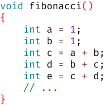
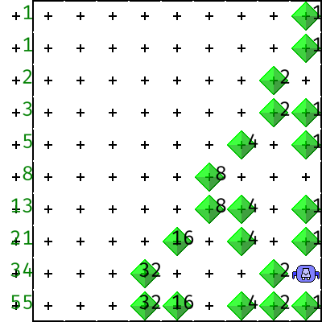

# Woche 3

📺 Variablen und Funktionen in 12 Minuten erklärt: https://www.youtube.com/watch?v=ZK6IsZlD5Hg

## Aufgaben

### Aufgabe 3.0

Installiere Skorbut **ab Schritt 6** gemäß https://github.com/fredoverflow/skorbut-release#getting-started

(Java wurde ja bereits für Karel The Robot installiert, deshalb kannst du **die ersten 5 Schritte überspringen**.)

### Aufgabe 3.1 Fibonacci (abnahmepflichtig & klausurrelevant)

Tippe folgende Funktion ab:



Setze den Tastaturcursor irgendwo in die Funktion `fibonacci` und drücke den START-Knopf, um die Funktion zu starten!
(Den Geschwindigkeitsregler und die STEP-Knöpfe kennst du ja bereits aus Karel.)

1. Diskutiere mit deinem Betreuer folgende Fragen:
   - Was bedeutet `int`?
   - Was bedeutet `int a = 1;`?
   - Was bedeutet `int c = a + b;`?
   - Spielt die Reihenfolge der 5 Zeilen von `int a` bis `int e` eine Rolle?
2. Berechne die 26. Fibonacci-Zahl:
   - Eine mechanisch runtergetippte Lösung mit 26 Variablen von `a` bis `z` ist völlig ausreichend
   - Wenn du dich nicht vertippst, sollte `121393` als 26. Fibonacci-Zahl herauskommen
   - Vielleicht fällt dir beim Runtertippen (oder irgendwann später) eine Lösung mit 2 oder 3 Variablen ein?
     - Eine Variable kann beliebig oft neue Werte annehmen
     - Dann lässt man den Datentyp `int` weg, weil sie ja bereits definiert ist:

```c
int a = ersterWert;
// ...
a = neuerWert;
// ...
a = neuerWert;
// ...
a = neuerWert;
// ...
```

### Aufgabe 3.2 Quadratwurzeln (abnahmepflichtig & klausurrelevant)

Mit dem [Heron-Verfahren](https://de.wikipedia.org/wiki/Heron-Verfahren) berechnet man Quadratwurzeln.
Dieses startet mit einem beliebigen Schätzwert und verfeinert diesen Schätzwert *mehrfach*
durch **Mittelwertbildung von 2 Zahlen:**
1. Schätzwert
2. Radikand geteilt durch Schätzwert

Wenn man zum Beispiel aus dem Radikand 100 die Quadratwurzel ziehen möchte
und mit dem (beliebig gewählten) Schätzwert 1 anfängt,
dann ist man nach 5 Verfeinerungen schon recht nah dran:

| Verfeinerung | Radikand | Schätzwert                          |
| -----------: | -------: | ----------------------------------: |
|            0 |    100.0 |              beliebig gewählt: 1.00 |
|            1 |    100.0 | (01.00 + 100.0 / 01.00) / 2 = 50.50 |
|            2 |    100.0 | (50.50 + 100.0 / 50.50) / 2 = 26.24 |
|            3 |    100.0 | (26.24 + 100.0 / 26.24) / 2 = 15.03 |
|            4 |    100.0 | (15.03 + 100.0 / 15.03) / 2 = 10.84 |
|            5 |    100.0 | (10.84 + 100.0 / 10.84) / 2 = 10.03 |

In dieser Aufgabe wollen wir 3 Funktionen implementieren, die aufeinander aufbauen:
1. `average` benutzt keine anderen Funktionen
2. `improveGuess` benutzt `average` (einmalig)
3. `squareRoot` benutzt `improveGuess` (mehrfach)

Implementiere die Funktion `average` zum Berechnen des Mittelwerts zweier Zahlen:

```c
double average(double x, double y)
{
    return // ... mathematische Formel zum Berechnen des Mittelwerts von x und y
}

void average_test()
{
    double eight = average(7.0, 9.0);
    assert(eight == 8.0); // weil 8.0 in der Mitte von 7.0 und 9.0 liegt
}
```

Implementiere die Funktion `improveGuess` zum *einmaligen* Verfeinern des Schätzwertes:

```c
double improveGuess(double radicand, double guess)
{
    return // ... Mittelwert von welchen beiden Größen? NICHT Radikand und Schätzwert!
}

void improveGuess_test()
{
    double three = improveGuess(8.0, 4.0);
    assert(three == 3.0); // weil 3.0 in der Mitte von 4.0 und 8.0/4.0=2.0 liegt
}
```

Implementiere die Funktion `squareRoot` mit 5 Verfeinerungen des Schätzwerts:

```c
double squareRoot(double radicand)
{
    double guess0 = 1.0;
    double guess1 = // ...
    double guess2 = // ...
    double guess3 = // ...
    double guess4 = // ...
    double guess5 = // ...
    return // ...
}

void squareRoot_test()
{
    double ten = squareRoot(100);
    assert(ten == 10.032578510960604);
}
```

### Aufgabe 3.3 Pythagoras (klausurrelevant)

Implementiere die Funktion `hypotenuse` zum Berechnen der Hypotenusenlänge eines rechtwinkligen Dreiecks.
Stelle dazu den Satz des Pythagoras `a² + b² = c²` geeignet um:

```c
double hypotenuse(double a, double b)
{
    // ...
}

void hypotenuse_test()
{
    double five = hypotenuse(3, 4);
    assert(five == 5.000023178253949);
}
```

### Aufgabe 3.4 Quadratische Gleichungen (klausurrelevant)

Implementiere die Funktion `countSolutions` zum Bestimmen der Anzahl Lösungen einer quadratischen Gleichung:


```c
// Eine quadratische Gleichung der Form ax² + bx + c = 0 hat 0 bis 2 Lösungen
int countSolutions(double a, double b, double c)
{
    // Konvertierung in Normalform x² + px + q = 0
    double p = // ...
    double q = // ...
    // ...
}

void countSolutionsExperiment()
{
    // Überlege dir eigene Beispiel-Gleichungen mit 0, 1, 2 Lösungen!
}
```

## FAQ

### Gibt es Karels Beeper (Bits) auch in C?

- In Karel gibt es Rätsel, die Binärzahlen mit Beepern als Bits realisieren, zum Beispiel `computeFibonacci`:



- Per Konvention interpretiert Karel immer 8 Bits zusammengehörig als eine Zahl (1 Byte)
- Karel kann aber immer nur 1 Bit gleichzeitig manipulieren (mittels `pickBeeper` und `dropBeeper`)
- Operationen zum Addieren von Zahlen (`addSlow` und `addFast`) müssen mühselig programmiert werden
- In C speichert man Zahlen dagegen in benannten Variablen und kann diese mühelos addieren:


### Was ist eine Variable?

- Eine Variable ist ein Stück Speicher mit einem Datentyp und einem Namen:
  - `int a;`
  - `double x;`
- Der *Datentyp* legt die möglichen Werte fest:
  - `int` für Ganzzahlen
  - `double` für Kommazahlen
- Der Name ermöglicht den (lesenden oder schreibenden) Zugriff auf die Variable:
  - *Schreiben* primär per Zuweisung mit dem Gleichheitszeichen: `a = 42;`
  - *Lesen* in den meisten anderen Kontexten, z.B. Rechnungen: `a + b`
- `int a = 42;` fasst Definition und erste Zuweisung zusammen:
  - `int a;` *Definition*
  - `a = 42;` erste *Zuweisung*
- Jede Funktion kann nur auf ihre eigenen Variablen zugreifen!

### Welche Datentypen gibt es sonst noch?

Skorbut hat feste Grenzen für alle Datentypen, auf anderen Plattformen können diese Grenzen abweichen:

|         Datentyp |   Skorbut Min |   Skorbut Max | Alternative Schreibweisen                  |
| ---------------: | ------------: | ------------: | ------------------------------------------ |
|    `signed char` |          -128 |          +127 | `char`                                     |
|  `unsigned char` |             0 |           255 |                                            |
|   `signed short` |        -32768 |        +32767 | `short` / `short int` / `signed short int` |
| `unsigned short` |             0 |         65535 |                       `unsigned short int` |
|     `signed int` |   -2147483648 |   +2147483647 | `int`   /                `signed`          |
|   `unsigned int` |             0 |    4294967295 |                        `unsigned`          |
|    `signed long` |   -2147483648 |   +2147483647 | `long`  /  `long int` /  `signed long int` |
|  `unsigned long` |             0 |    4294967295 |                        `unsigned long int` |
|          `float` | 1.4 * 10^ -45 | 3.4 * 10^ +38 |                                            |
|         `double` | 4.9 * 10^-324 | 1.8 * 10^+308 |                                            |

Häufig sind `long`s auf 64-bit-Plattform größer und `int`s auf 16-bit-Plattformen kleiner.

### Wie übergibt man Zahlen an eine Funktion?

1. Bei der Funktionsdefinition definiert man in den runden Klammern die *Parameter*:
   - `void addSlowFail(int x, int y) { ... }`
2. An allen Aufrufstellen übergibt man in den runden Klammern entsprechende *Argumente*:
   - `{ ... addSlowFail(a, b); ... }`

```C
void addSlowFail(int x, int y) // x und y sind Parameter
{
    while (x > 0)
    {
        --x; // decrement
        ++y; // increment
    }
}

void addSlowFailExperiment()
{
    int a = 1;
    int b = 1;
    addSlowFail(a, b); // a und b sind Argumente

    // a und b sind nach wie vor 1
}
```

- Beim Aufruf einer Funktion werden die Argumente in die Parameter **kopiert**:
  - `int x = a;`
  - `int y = b;`
- Änderungen von Parametern wirken sich *nicht* auf die Argumente aus:
  - `--x` dekrementiert `x`, aber *nicht* `a`
  - `++y` inkrementiert `y`, aber *nicht* `b`

### Wie liefert man eine Ergebniszahl an den Aufrufer zurück?

1. Statt `void` schreibt man `int` für den *Ergebnistyp*:
   - `int addSlow(...) { ... }`
   - `^^^`
2. Sobald das Ergebnis feststeht, liefert man es mit `return ergebnis;` zurück:
   - `return y;`
3. Der Aufrufer speichert das Ergebnis in einer Variable ab oder verarbeitet es andersartig weiter:
   - `int c = addSlow(a, b);` ✔
   - `return addSlow(a, b);` ✔
   - `if (addSlow(a, b) != a + b) { ... }` ✔
   - `int abcd = addSlow(addSlow(a, b), addSlow(c, d));` ✔
   - `addSlow(a, b);` ⚠️
     - ignoriert die berechnete Summe
     - die Berechnung war also umsonst
     - genau so sinnlos wie `a + b;`

```c
int addSlow(int x, int y)
{
    while (x > 0)
    {
        --x;
        ++y;
    }
    return y; // liefert den Wert von y als Ergebnis an den Aufrufer zurück
}

void addSlowExperiment()
{
    int a = 1;
    int b = 1;
    int c = addSlow(a, b); // speichert y=2 in c
    int d = addSlow(b, c); // speichert y=3 in d
    int e = addSlow(c, d); // speichert y=5 in e
    // ...
}
```

**Achtung:** Die Funktion `addSlow` entsprang einem didaktischen Gedankenexperiment:

> Wenn `+` nicht existieren würde, wie könnte man dann Karels `addSlow` in C nachbauen?

In der Praxis würde man *niemals* `addSlow(a, b)` verwenden, sondern *immer* `a + b` (viel schneller).

### Kann man auch andere mathematische Funktionen als `+` mit C-Funktionen realisieren?

Klar, hier sind 3 weitere Beispiele:

```
square : ℤ  → ℤ
square  (x) = x ⋅ x
```

```c
int square(int x)
{
    return x * x;
}
```

```
minimum : ℤ, ℤ  → ℤ
minimum  (x, y) = { x für x < y
                  { y für x ≥ y

```

```c
int minimum(int x, int y)
{
    if (x < y)
    {
        return x;
    }
    else
    {
        return y;
    }
}
```

```
interpolate : ℝ, ℝ, ℝ → ℝ
interpolate  (z, o, t) = z + (o - z) ⋅ t
```

```c
double interpolate(double z, double o, double t)
{
    return z + (o - z) * t;
}
```

### Wie prüft man, ob eine Variable einen bestimmten Wert hat?

Der Vergleichsoperator `==` prüft, ob beide Seiten gleich sind:

```C
int absoluteValue(int x)
{
    if (x ==  -2147483648)
    {
        return 2147483647;
    }
    else if (x < 0)
    {
        return -x;
    }
    else
    {
        return x;
    }
}
```

### Was bedeutet `assert(annahme);`?

- Damit wird sichergestellt, dass eine vom Entwickler getroffene Annahme auch tatsächlich wahr ist
- Falls die Annahme wieder Erwarten falsch ist, wird das Programm mit einer Fehlermeldung abgebrochen
- Zum Testen von Funktionen ist `assert` sehr praktisch:

```c
void funktion_test()
{
    double tatsaechlichesErgebnis =  funktion(argumente);
    assert(tatsaechlichesErgebnis == erwartetesErgebnis);
}
```

### Was ist der Unterschied zwischen `=` und `==`?

- *Zuweisung*: `x = 42` kopiert den Wert `42` in die Variable `x` rein
- *Vergleich*: `x == 42` prüft, ob die Variable `x` den Wert `42` hat

### Welche Vergleichsoperatoren gibt es sonst noch?

| Operator | Bedeutung      |
| -------- |--------------- |
| `==`     | gleich         |
| `!=`     | ungleich       |
| `<`      | kleiner        |
| `<=`     | kleiner/gleich |
| `>`      | größer         |
| `>=`     | größer/gleich  |

### Wie kann man mehrere Bedingungen miteinander kombinieren?

Genau wie in Karel mit `&&` (und) bzw. `||` (oder):

```C
int isDigit(int x)
{
    return 0 <= x && x < 10;
}

int isPrimeDigit(int x)
{
    return x == 2 || x == 3 || x == 5 || x == 7;
}
```

Da C89 keinen Datentyp für Wahrheitswerte hat,
verwendet man stattdessen die `int`-Werte `0` (falsch) bzw. `1` (wahr).
