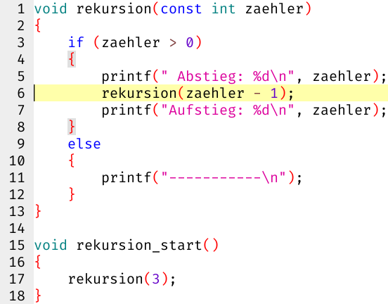
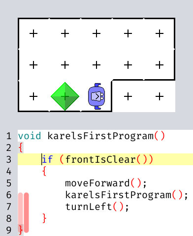
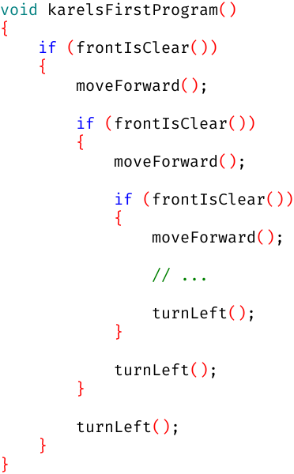

# Woche 10

## Aufgaben

### Aufgabe 10.0 Rekursion (klausurrelevant)



- Wenn das Programm in Zeile 6 pausiert und man auf `step into (F5)` klickt:
  - Was ändert sich im Arbeitsspeicher?
  - In welcher Zeile geht es weiter?
- Wenn das Programm in Zeile 13 pausiert und man auf irgendeinen `step`-Knopf klickt:
  - Was ändert sich im Arbeitsspeicher?
  - In welcher Zeile geht es weiter?
- Wie oft wird Zeile 5 ausgeführt?
- Wie oft wird Zeile 7 ausgeführt?
- Wie oft wird Zeile 11 ausgeführt?

### Aufgabe 10.1 Wanderzeiger (abnahmepflichtig & klausurrelevant)

In Woche 6 haben wir gelernt, über Strings zu schleifen:

```c
void schleifeUeberAlleZeichen(const char s[])
{
    for (int i = 0; s[i]; ++i)
    {
        printf("Das Zeichen %c hat den ASCII-Code %d\n", s[i], s[i]);
    }
}
```

Da der scheinbare Array-Funktionsparameter `(const char s[])`
in Wirklichkeit ein Zeiger-Funktionsparameter `(const char* s)` ist,
können wir uns die Schleifenvariable `i` auch schenken:

```c
void schleifeUeberAlleZeichen(const char* s)
{
    for (; *s; ++s)
    {
        printf("Das Zeichen %c hat den ASCII-Code %d\n", *s, *s);
    }
}
```

Nimm entsprechende Vereinfachungen für `zaehleZeichen` und `findeZeichen` aus Woche 6 vor!

### Aufgabe 10.2 Floodfill (abnahmepflichtig & klausurrelevant)

```c
const char* floodfill_printme;

enum { FLOODFILL_RIGHT = 1, FLOODFILL_DOWN = 33 };

void floodfill(char* const dora)
{
    if (*dora == ' ')
    {
     // *dora = '»'; printf("%s", floodfill_printme); floodfill(dora + FLOODFILL_RIGHT); // Zeile 9
     // *dora = 'v'; printf("%s", floodfill_printme); floodfill(dora + FLOODFILL_DOWN); // Zeile 10
        *dora = '·'; printf("%s", floodfill_printme);
    }
}

void floodfill_start()
{
    char world[] = "+==============================+\n|                              |\n| #  #   ##    ##   ####  #    |\n| # #   #  #  #  #  #     #    |\n| ##    ####  ###   ###   #    |\n| # #   #  #  # #   #     #    |\n| #  #  #  #  #  #  ####  #### |\n|                              |\n+==============================+\n";
    floodfill_printme = world;
    floodfill(world + FLOODFILL_DOWN + FLOODFILL_RIGHT);
}
```

1. Starte die Funktion `floodfill_start` und erfreue dich an dem Punkt `·` links oben
2. Was passiert, wenn du Zeile 9 aktivierst und die Funktion erneut startest?
3. Was passiert, wenn du Zeile 9 wieder deaktivierst und *stattdessen* Zeile 10 aktivierst?
4. Was passiert, wenn *beide* Zeilen 9 und 10 aktiv sind?
5. Ergänze die Funktion `floodfill` um die fehlenden zwei Himmelsrichtungen

**Optional:**

6. Ersetze im Initialisierungsstring von `world` ein Leerzeichen durch ein Fragezeichen `?`
7. Wenn `floodfill` das Fragezeichen `?` findet:
   - Ersetze es durch ein Ausrufezeichen `!`
   - Springe aus allen `floodfill`-Aufrufen zurück... aber wie?!<br>
   **SPOILER** Irejraqr nyf Retroavfglc obby fgngg ibvq, hz qrz Nhsehsre zvggrvyra mh xöaara, bo qvr Fhpur orervgf resbytervpu jne bqre avpug. Angüeyvpu zhffg qh qnaa nhpu wrqra Shaxgvbafnhsehs zvg rvare Snyyhagrefpurvqhat üoreceüsra haq fvaaibyy erntvrera!

### Aufgabe 10.3 Gemeinsame Präfixlänge (klausurrelevant)

Implementiere die Funktion `commonPrefixLength`, die zählen soll,
wie viele Zeichen der beiden Strings am Anfang hintereinander gleich sind:

```c
int commonPrefixLength(const char* s, const char* t)
{
    // ...
}

void commonPrefixLength_test()
{
    //                         _        _
    assert(commonPrefixLength("apfel", "abfall") == 1);
    //                         __       __
    assert(commonPrefixLength("apfel", "apple") == 2);
    
    assert(commonPrefixLength("apfel", "birne") == 0);
    
    assert(commonPrefixLength("apfel", "") == 0);
    
    assert(commonPrefixLength("", "birne") == 0);
    //                         _____    _____
    assert(commonPrefixLength("apfel", "apfelkuchen") == 5);
    //                         _____          _____
    assert(commonPrefixLength("apfelkuchen", "apfel") == 5);
    //                         _____    _____
    assert(commonPrefixLength("apfel", "apfel") == 5);
}
```

### Aufgabe 10.4 Strings vergleichen (klausurrelevant)

Implementiere den `strcmp`-Klon `my_strcmp` zum Vergleichen von Strings.
Genau wie `strcmp(a, b)` soll `my_strcmp(a, b)` folgendes liefern:
- 0, falls in `a` genau die gleichen Zeichen hintereinander stehen wie in `b`
- *irgendeine* negative Zahl, falls `a` lexikographisch vor `b` liegt
- *irgendeine* positive Zahl, falls `a` lexikographisch nach `b` liegt

```c
int my_strcmp(const char* s, const char* t)
{
    // ...
}

void my_strcmp_test()
{
    assert(my_strcmp("apple", "apple") == 0);
    assert(my_strcmp("apple", "pear") < 0);
    assert(my_strcmp("pear", "apple") > 0);

    assert(my_strcmp("apple", "ape") > 0);
    assert(my_strcmp("ape", "apple") < 0);

    assert(my_strcmp("apple", "apply") < 0);
    assert(my_strcmp("apply", "apple") > 0);

    assert(my_strcmp("apple", "applepie") < 0);
    assert(my_strcmp("applepie", "apple") > 0);

    assert(my_strcmp("", "") == 0);
    assert(my_strcmp("", "a") < 0);
    assert(my_strcmp("a", "") > 0);
}
```

Welche Funktionen darf `my_strcmp` aufrufen?
- `strcmp` ist natürlich verboten, sonst würden wir nichts lernen
- `commonPrefixLength` ist erlaubt und sogar explizit erwünscht!
- `strlen` ist erlaubt aber nicht erforderlich

## FAQ

### Sind Arrays eigentlich Zeiger?

**Nein**, aber Arrays werden bei ihrer Verwendung häufig in Zeiger *konvertiert*:

> ISO C90 §3.2.2.1
>
> Except when it is
> - the operand of the `sizeof` operator
> - or the unary `&` operator,
> - or is a character `string literal` used to initialize an array of character type,
>
> a variable that has type *array of type* is converted to an expression that has type *pointer to type*
> that points to the initial member of the array object and is not a variable.

Deshalb ist es zum Beispiel möglich, einen Zeiger mit einem Array zu initialisieren:

```c
char  a[] = "apfel";
char* z   = a; // z zeigt auf das erste Zeichen von a
```
```
  +-----+-----+-----+-----+-----+-----+
a | 'a' | 'p' | 'f' | 'e' | 'l' | '\0'|
  +-----+-----+-----+-----+-----+-----+
     ^
  +--|--+
z |&a[0]|
  +-----+
```

Zeiger können jederzeit auf andere Arrays umgebogen werden:

```c
char  b[] = "birne";
      z   = b;
```
```
  +-----+-----+-----+-----+-----+-----+
a | 'a' | 'p' | 'f' | 'e' | 'l' | '\0'|
  +-----+-----+-----+-----+-----+-----+

  +-----+
z |&b[0]|
  +--|--+
     v
  +-----+-----+-----+-----+-----+-----+
b | 'b' | 'i' | 'r' | 'n' | 'e' | '\0'|
  +-----+-----+-----+-----+-----+-----+
```

Arrays können dagegen niemals auf der linken Seite einer Zuweisung stehen:

```c
a = z;
 // char*
 //  cannot be converted to
 // char[6]

a = b;
 // char[6]
 //  cannot be converted to
 // char[6]
```

### Sind Array-Funktionsparameter eigentlich Zeiger-Funktionsparameter?

Ja, das ist eine **Sonderregel** für Funktionsparameter:

> ISO C90 §3.7.1 **Function** definitions, Semantics
>
> A declaration of a **parameter** as *array of type* shall be adjusted to *pointer to type*

```c
void funktion(char s[6], char t[], char* u)
{
    assert(sizeof s == sizeof(char*));
    assert(sizeof t == sizeof(char*));
    assert(sizeof u == sizeof(char*));
}

void sonderregel()
{
    char a[] = "apfel";
    assert(sizeof a == sizeof(char[6]));
    funktion(a, a, a);
}
```

```
  +-----+-----+-----+-----+-----+-----+
a | 'a' | 'p' | 'f' | 'e' | 'l' | '\0'|
  +-----+-----+-----+-----+-----+-----+
   ^ ^ ^
   | | |
   | | +---------+
   | |           |
   | +-----+     |
   |       |     |
  +|----+  |     |
s |&a[0]|  |     |
  +-----+  |     |
           |     |
        +--|--+  |
      t |&a[0]|  |
        +-----+  |
                 |
              +--|--+
            u |&a[0]|
              +-----+
```

### Warum kann ich dann nicht `char x[];` für einen Zeiger schreiben?

Weil lokale Variablen keine Funktionsparameter sind.
Funktionsparameter befinden sich zwischen den runden Klammern im Funktionskopf:

```c
void funktion(char parameter[]) // char* parameter
{
    char lokal[]; // missing array size or initializer
}
```

### Wenn Array-Funktionsparameter eigentlich Zeiger-Funktionsparameter sind, wieso klappt `parameter[i]` dann trotzdem?

- Nützliche Lüge:
  - Der Zugriff `x[i]` funktioniert sowohl direkt auf Arrays als auch indirekt über Zeiger
- Technische Wahrheit:
  - Der Zugriff `x[i]` funktioniert *ausschließlich* über Zeiger
  - Wenn `x` ein Array ist, wird gemäß §3.2.2.1 ein Zeiger auf das erste Element bereitgestellt
  - Tatsächlich ist `x[i]` nur syntaktischer Zucker für `*(x + i)`

### Man kann mit Zeigern *rechnen*?!

Ja, das ist recht nützlich für die Iteration über Strings und andere Arrays:

```c
int my_strlen(const char* s)
{
    const char* t = s;
    while (*t)
    {
        ++t;      // Zeiger-Inkrement
    }
    return t - s; // Zeiger-Differenz
}

void my_strlen_test()
{
    assert(my_strlen("") == 0);
    assert(my_strlen("I") == 1);
    assert(my_strlen("we") == 2);
    assert(my_strlen("you") == 3);
    assert(my_strlen("they") == 4);
}
```

### Was bedeutet `const` bei Zeigertypen?

Sowohl die gezeigte Variable `*p` als auch die Zeigervariable `p`
lassen sich mit `const` vor versehentlichen Änderungen schützen:

| West `const` Syntax | `*p = ...` | `p = ...` | East `const` Syntax |
| ------------------- | ---------- | --------- | ------------------- |
| `char*`             | ✔️         | ✔️       |                     |
| `const char*`       | ❌         | ✔️       | `char const*`       |
| `char* const`       | ✔️         | ❌       |                     |
| `const char* const` | ❌         | ❌       | `char const* const` |

### Eine Funktion kann sich selber aufrufen?!

Ja, das nennt man *Rekursion*.
**Ein Selbstaufruf ist technisch nichts besonderes, sondern verhält sich wie jeder andere Aufruf auch.**
Insbesondere entsteht in Karel ganz normal ein roter Balken von der Aufrufstelle bis zum Funktionsende,
damit Karel sich später noch erinnern kann, wo er nach Rücksprung aus dem Selbstaufruf weitermachen soll:



Für *jedes* `moveForward` in Zeile 5 wird also *jeweils* ein `turnLeft` in Zeile 7 ausgeführt!
Da Karel insgesamt 2 Schritte nach vorne geht, wird er sich insgesamt um 180° drehen.

Theoretisch kann jeder Funktionsaufruf in Karel-Programmen
ersetzt werden durch den Rumpf der aufgerufenen Funktion.
Das ist auch ein valides mentales Modell für Rekursion in Karel,
aber praktisch funktioniert das natürlich nicht unendlich oft:



### Springt ein Selbstaufruf nicht bloß zum Anfang der Funktion zurück?

Nein, das ist der größte Anfänger-Irrtum beim Lernen von Rekursion!
Tatsächlich entsteht bei jedem Selbstaufruf in Karel ein roter Balken
bzw. wird in Skorbut Arbeitsspeicher für die erneute *Aktivierung* der Funktion reserviert.
Ein und dieselbe Funktion kann also mehrfach in verschiedenen Programmzeilen aktiv sein,
und jede Aktivierung hat ihre eigenen Parameter und lokalen Variablen.
